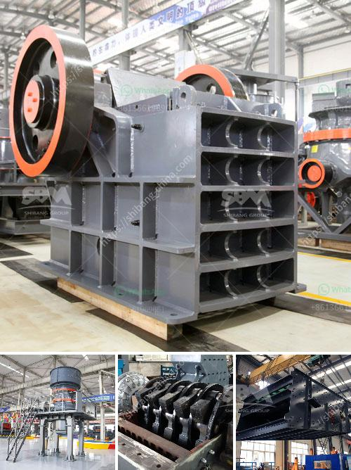

<h3>crusher manufacturers in peru</h3>
Peru, officially known as the Republic of Peru, is a country located in western South America. Known for its rich biodiversity and abundance of natural resources, Peru is a leading producer of minerals, including copper, gold, silver, and zinc. The efficient extraction and processing of these resources require the assistance of well-equipped crusher manufacturers. Let's delve into the significance of crusher manufacturers in Peru and how they contribute to the sustainable development of the mining industry.

Mining plays a vital role in Peru's economy, contributing significantly to its GDP and job creation. With abundant mineral reserves, extracting these resources in an environmentally responsible manner is crucial for sustainable development. This is where crusher manufacturers in Peru have a significant role to play. Crushers are industrial machines used to break large rocks into smaller rocks, gravel, or rock dust, facilitating the extraction process by reducing the size of raw materials. These machines are pivotal in mining operations across Peru.

Crusher manufacturers in Peru are focused on providing durable crushing equipment that can withstand the demanding conditions of the mining industry. Their machinery ensures efficient and reliable crushing of various types of ores, making it easier to extract and process valuable minerals. Whether it is hard rock deposits or alluvial deposits, crushers are designed to reduce the size of materials and prepare them for subsequent stages such as grinding, flotation, and leaching.

One prominent crusher manufacturer in Peru is FLSmidth. FLSmidth specializes in providing high-quality machinery for the mining industry, including crushers, screens, and wear parts. They offer comprehensive solutions that address the specific needs of their clients, helping them optimize their mineral processing operations. Their crushers are designed to minimize downtime, enhance productivity, and reduce operating costs. With a strong focus on innovation and sustainability, FLSmidth is committed to providing crushers that are energy-efficient and environmentally friendly.

Another notable crusher manufacturer in Peru is Metso Outotec. With a strong presence in the mining industry, Metso Outotec offers a wide range of crushers tailored to meet the diverse needs of their customers. Their crushers are designed to deliver high performance and optimized energy efficiency. Metso Outotec also provides comprehensive support services, including maintenance and spare parts, ensuring that their clients' crushing operations remain uninterrupted.

Collaboration between crusher manufacturers and mining companies in Peru is essential for sustainable resource extraction. Manufacturers work closely with mining companies to understand their specific requirements and challenges, allowing them to develop customized crushing solutions. This collaboration contributes to the efficient and responsible extraction of natural resources, minimizing environmental impact and optimizing mineral recovery.

In conclusion, crusher manufacturers in Peru play a vital role in the sustainable development of the mining industry. Their efficient and reliable machinery enables the extraction and processing of valuable minerals in an environmentally responsible manner. As Peru continues to expand its mining operations, the demand for advanced crushing equipment will likely increase. By focusing on innovation, sustainability, and collaboration, crusher manufacturers are poised to meet the evolving needs of Peru's mining industry and contribute to its long-term success.
<h3>Contact us</h3><ul><li><strong>Whatsapp:&nbsp;<a href="https://wa.me/8613661969651">+8613661969651</a></strong></li><li><a href="https://swt.shibang-china.com/?git&amp;zhl&amp;crusher manufacturers in peru"><strong>Online Service(chat now)</strong></a></li></ul><h3>Related</h3><ul><li><a href='mill grinding plants balls.md'>mill grinding plants balls</a></li><li><a href='quartz stone making process.md'>quartz stone making process</a></li><li><a href='stone crusher machines in peru.md'>stone crusher machines in peru</a></li><li><a href='bentonite powder raymond mill.md'>bentonite powder raymond mill</a></li><li><a href='mobile crusher italy.md'>mobile crusher italy</a></li></ul>