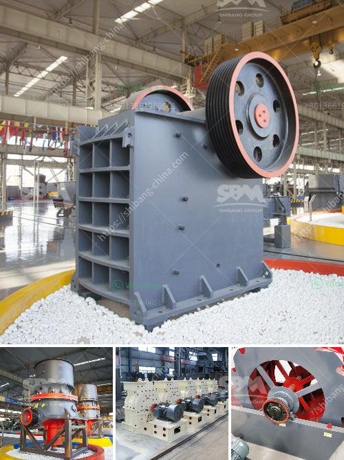

<h3>crusher manufacturing companies in india</h3>
India is one of the fastest-growing economies in the world and is expected to become the second-largest manufacturing hub by 2025. The country's robust infrastructure development, rapid urbanization, and increasing demand for construction materials have stimulated growth in the crusher manufacturing companies in India.

Crushers are machines used to crush and reduce the size of large rocks, stones, or ore into smaller rocks, gravel, or rock dust. These machines are usually employed for primary crushing within mines and quarries where raw materials are extracted. They are also crucial in the construction industry for producing aggregates used in concrete and asphalt.

India boasts a wide range of crusher manufacturing companies that are renowned for their excellent engineering and innovative designs. These companies are continuously striving to improve their offerings by integrating advanced technologies and enhancing product efficiency. Let's take a look at some of the prominent crusher manufacturing companies in India.

First on the list is Torsa Machines Limited, which has been in the market for over two decades. It is known for manufacturing state-of-the-art crushers that are used for various applications, including mining, construction, and recycling. Torsa Machines offers a wide range of jaw crushers, cone crushers, and impact crushers, all designed to deliver high performance and reliability.

Another leading player in the crusher manufacturing industry is Propel Industries. With a focus on technology-driven innovation, Propel Industries manufactures a comprehensive range of crushers, screens, feeders, and washers. Their products cater to the construction, mining, and aggregate industries and are known for their superior quality and durability.

L&T Metso is a joint venture between Larsen & Toubro and Metso, a global leader in the crusher manufacturing sector. L&T Metso focuses on providing solutions for the mining and construction industries and offers a diverse range of crushers, including jaw crushers, cone crushers, and impact crushers. Their crushers are known for their reliability, efficiency, and advanced features.

Puzzolana Machinery Fabricators LLP is another renowned crusher manufacturing company in India. Established in 1972, they specialize in designing, manufacturing, and supplying crushers and material handling equipment for various industries. Puzzolana's crushers are known for their robust construction, high performance, and low maintenance requirements.

Maxwell Crushtech is a leading manufacturer and exporter of crushers, screens, grinders, and allied equipment. With a strong focus on technological innovation, Maxwell Crushtech offers a wide range of crushers designed to cater to diverse customer requirements. Their crushers are characterized by their efficiency, ease of use, and minimal downtime.

In conclusion, the crusher manufacturing companies in India are continuously striving to deliver high-quality, innovative, and efficient crushers that cater to the diverse needs of their customers. With a focus on advanced technologies, durability, and performance, these companies have established themselves as leaders in the global crusher manufacturing industry. As India's construction and infrastructure sectors continue to grow, the demand for crushers is expected to increase, providing further opportunities for these companies to expand their market presence.
<h3>Contact us</h3><ul><li><strong>Whatsapp:&nbsp;<a href="https://wa.me/8613661969651">+8613661969651</a></strong></li><li><a href="https://swt.shibang-china.com/?git&amp;zhl&amp;crusher manufacturing companies in india"><strong>Online Service(chat now)</strong></a></li></ul><h3>Related</h3><ul><li><a href='stone crusher machine in kenya.md'>stone crusher machine in kenya</a></li><li><a href='project cost of stone crusher of 100 tph.md'>project cost of stone crusher of 100 tph</a></li><li><a href='alluvial gold plants for sale south africa.md'>alluvial gold plants for sale south africa</a></li><li><a href='picture of silica sand process plant.md'>picture of silica sand process plant</a></li><li><a href='aggregate washing plant saudi arabia.md'>aggregate washing plant saudi arabia</a></li></ul>