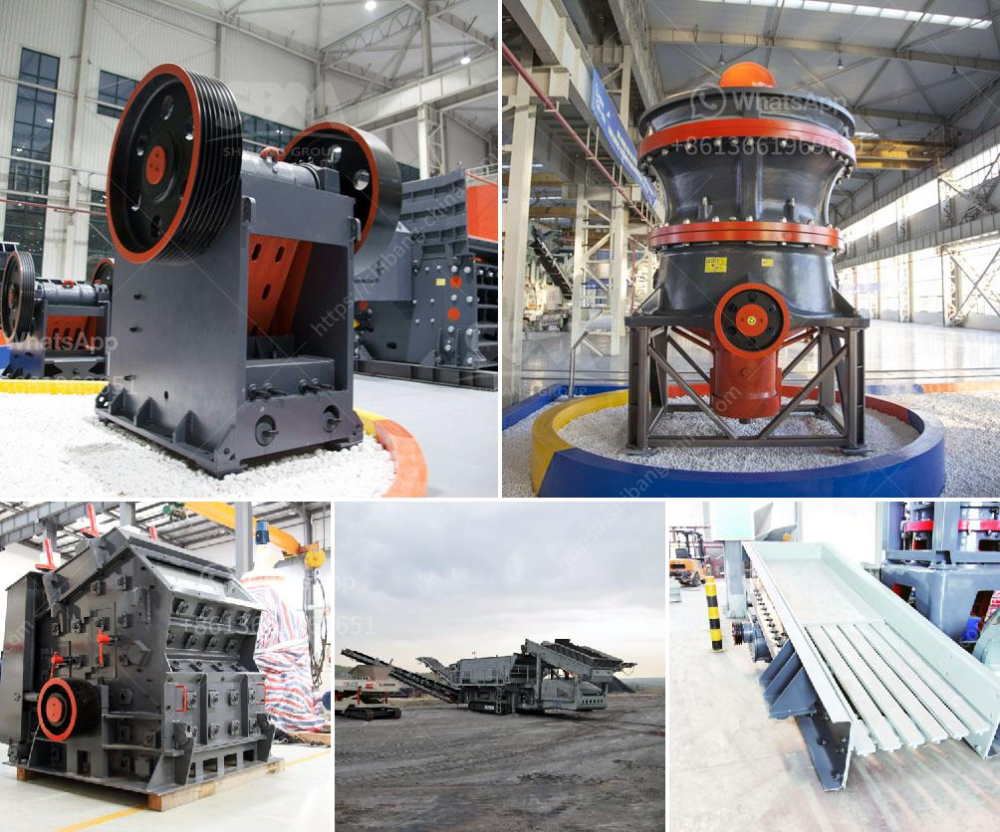

<h3>crusher on lease basis in nigeria</h3>
Crusher is one of the important equipment needed for recycling or disposal of aggregates, both large and small. Crushers are used primarily to break down big rocks into smaller rubble rocks so that they can be shredded or disposed of properly. In Nigeria, crushers are available for lease, and it is a profitable venture for anyone who wants to invest in the business.

Leasing a crusher in Nigeria is not without its challenges. The process of leasing a crusher has been plagued with inefficiency, which hampers both operators and investors. This inefficiency stems from a lack of proper regulations guiding the leasing of crushers and insufficient infrastructures to support the business. However, this sector of the Nigerian economy holds great promise due to the rapid growth of the construction industry.

The construction industry in Nigeria is experiencing substantial growth, with various infrastructure projects being executed across the country. As a result, the demand for crushed stones, sand, and other essential materials has shot up significantly. Crushers play a vital role in meeting this demand, as they are essential for breaking down the rocks needed for construction projects.

Investing in a crusher on a lease basis can be lucrative for entrepreneurs, as there is a constant demand for aggregates in the construction industry. The cost of acquiring a crusher machine can be quite high, so it makes economic sense to lease crushers on a temporary basis. As a result, investors save their capital for other aspects of their business while generating income from leasing the crusher.

However, several challenges need to be addressed to make leasing crushers in Nigeria a more attractive option. First and foremost, regulations and policies need to be put in place to streamline the crusher leasing process. There should be standard leasing contracts that protect the rights of both the owner and the lessee. This will ensure transparency and fairness in the lease agreement.

Additionally, the government should invest in the creation of adequate infrastructure to support the crusher leasing business. Good road networks and reliable power supply are critical for the transportation and operation of crushers. Without these infrastructural developments, the rental business may face limitations and struggle to thrive.

Moreover, tax incentives or subsidies can encourage more investors to venture into the crusher leasing business. The government should consider policies that promote the growth of this sector by offering favorable tax regimes to investors. Such incentives would attract both local and foreign investors and promote economic growth in Nigeria.

Lastly, public-private partnerships should be encouraged to develop the crusher leasing business. Collaboration between private companies and government agencies can help address the challenges faced by the industry. Joint investments in infrastructure and the creation of enabling environments will contribute to the growth of the crusher leasing business and the overall economy.

In conclusion, the crusher leasing business in Nigeria holds significant potential for growth due to the steady demand for construction aggregates. It is essential for the government to address the challenges facing the sector by implementing appropriate policies and developing necessary infrastructure. With the right regulations, tax incentives, and public-private partnerships, the crusher leasing business can become a thriving industry in Nigeria.
<h3>Contact us</h3><ul><li><strong>Whatsapp:&nbsp;<a href="https://wa.me/8613661969651">+8613661969651</a></strong></li><li><a href="https://swt.shibang-china.com/?git&amp;zhl&amp;crusher on lease basis in nigeria"><strong>Online Service(chat now)</strong></a></li></ul><h3>Related</h3><ul><li><a href='cone crusher in the philippines.md'>cone crusher in the philippines</a></li><li><a href='dealer of vibrating screen philippines.md'>dealer of vibrating screen philippines</a></li><li><a href='concrete crusher for sale in nigeria.md'>concrete crusher for sale in nigeria</a></li><li><a href='ball mill capacity.md'>ball mill capacity</a></li><li><a href='jaw crusher specifications.md'>jaw crusher specifications</a></li></ul>