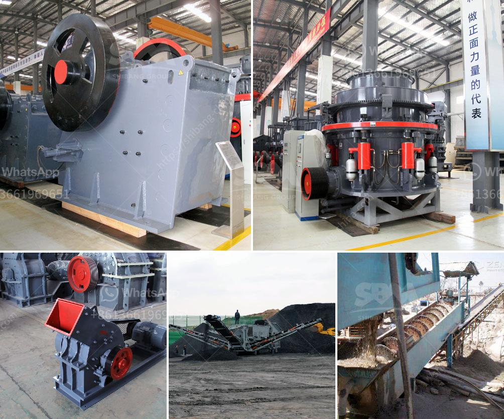

<h3>crusher plant equipment supplier in saudi arabia</h3>
Crusher plant equipment supplier in Saudi Arabia is a major contributor to the national economy and a primary source of employment opportunities. With robust economic growth, the Kingdom of Saudi Arabia is continuously evolving and seeking innovative ways to diversify its economy through various sectors. The mining industry, in particular, plays a crucial role in the Kingdom's economic development.

Saudi Arabia possesses large deposits of various minerals, including bauxite, copper, gold, iron, lead, silver, tin, and non-metallic minerals. Mining crushing equipment is widely used in multiple fields, such as construction, road and railway building, mineral mining and processing, cement production, and tunnel excavation.

Crusher plant equipment supplier in Saudi Arabia provides a full range of crushing plants with different configurations and capacities. Designed and optimized by experienced professionals, these plants can be easily relocated, and they offer excellent output capacity. Their efficiency is determined by several factors, including the type of raw materials, size, and hardness of the stones, desired final product size, and reliability and durability of the equipment.

Crusher plants in Saudi Arabia are equipped with primary, secondary, and tertiary crushers, including jaw crushers, cone crushers, and impact crushers. Additionally, crushers come with multiple features such as vibrating screens and conveyors to improve their performance and efficiency.

Jaw Crusher: Jaw crushers are primarily used for coarse crushing. They are capable of breaking down large rocks into smaller sizes suitable for further processing. Powerful and reliable, jaw crushers are widely used in mining, construction, and quarrying industries.

Cone Crusher: Cone crushers are commonly used for secondary and tertiary crushing. They have a robust design, high productivity, and excellent efficiency. Cone crushers are ideal for producing cubical-shaped aggregates for concrete and asphalt production. They are highly adaptable and can be easily adjusted to meet specific crushing requirements.

Impact Crusher: Impact crushers are versatile machines that can handle a variety of materials, including soft and medium-hard rocks. They are designed to produce high-quality cubic-shaped aggregates for road construction and concrete production. Impact crushers are equipped with hydraulic systems that enable quick and easy adjustment of the crushing gap.

Crusher plant equipment suppliers in Saudi Arabia prioritize delivering high-quality products and services. They make sure that their crushers are designed to provide maximum productivity, reliability, and minimum maintenance. These suppliers also follow strict quality control processes to ensure that their equipment meets international standards.

As Saudi Arabia continues to invest in infrastructure development and industrialization, the demand for construction materials is on the rise. Crusher plant equipment suppliers play a crucial role in meeting this demand by supplying high-quality aggregates, produced by crushing rocks of different sizes and types.

To conclude, crusher plant equipment suppliers in Saudi Arabia offer a wide range of crushing plants suited for diverse applications. They ensure maximum productivity, reliability, and efficiency, providing a long-term solution for meeting the Kingdom's construction and mining needs. With continuous technological advancements, these suppliers are committed to keeping up with global standards and contributing to Saudi Arabia's economic growth.
<h3>Contact us</h3><ul><li><strong>Whatsapp:&nbsp;<a href="https://wa.me/8613661969651">+8613661969651</a></strong></li><li><a href="https://swt.shibang-china.com/?git&amp;zhl&amp;crusher plant equipment supplier in saudi arabia"><strong>Online Service(chat now)</strong></a></li></ul><h3>Related</h3><ul><li><a href='washing process of chromite ore beneficiation.md'>washing process of chromite ore beneficiation</a></li><li><a href='granite crusher for sale.md'>granite crusher for sale</a></li><li><a href='concrete aggregate crushing plant.md'>concrete aggregate crushing plant</a></li><li><a href='ball mill grinder.md'>ball mill grinder</a></li><li><a href='crusher stone crusher 4 ton.md'>crusher stone crusher 4 ton</a></li></ul>