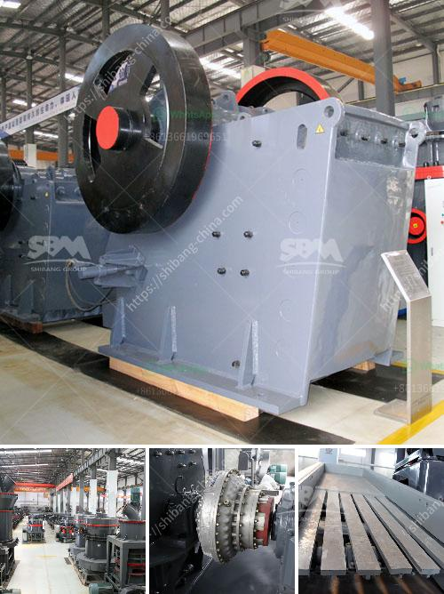

<h3>crusher plant in kenya</h3>
Crusher plant represents an important industry in Kenya. With the increasing development of construction industry, the demand for stone and aggregate is constantly growing. As a result, there is a need for crusher plants to grind the rocks into smaller sizes and produce aggregates for various projects. This article explores the crusher plant industry in Kenya, highlighting the main drivers, challenges, and potential opportunities.

One of the key drivers of the crusher plant industry in Kenya is the increasing need for infrastructure development. Kenya has experienced rapid urbanization in recent years, leading to a surge in construction activities. The government and private sector are investing heavily in the construction of roads, highways, bridges, and buildings. These projects require a significant amount of aggregates, which can only be produced through the use of crusher plants.

Another driver of the crusher plant industry in Kenya is the growing population. With a population of over 50 million people, the demand for housing and infrastructure is expected to continue rising. As the population increases, so does the need for stone and aggregates in the construction industry. Crusher plants play a crucial role in meeting this demand by producing the necessary materials for construction projects.

However, the crusher plant industry in Kenya also faces several challenges. One of the main challenges is the availability of suitable land for setting up crusher plants. Kenya has limited land resources, and finding appropriate sites for crusher plants can be quite challenging. Additionally, there are often conflicts with local communities who may oppose the establishment of these plants due to environmental concerns or other reasons.

Another challenge is the lack of skilled operators and technicians in the crusher plant industry. Operating crusher plants requires a certain level of expertise, and finding qualified personnel can be a struggle. This is particularly true for remote areas where crusher plants are needed the most. Addressing this challenge will require investment in training programs and initiatives to attract and retain skilled workers.

Despite these challenges, there are also potential opportunities in the crusher plant industry in Kenya. The government has recognized the need for infrastructure development and has initiated various projects aimed at improving the transport network across the country. This presents an opportunity for crusher plant operators to secure contracts for supplying aggregates for these projects.

Furthermore, there is an increasing demand for sustainable and environmentally friendly practices in the construction industry. This presents an opportunity for crusher plant operators to adopt green technologies and processes to reduce their environmental impact. Investing in modern, efficient, and eco-friendly equipment can help crusher plant operators differentiate themselves and attract more customers.

In conclusion, the crusher plant industry in Kenya plays a significant role in meeting the demand for stone and aggregates in the construction sector. While there are challenges such as the availability of suitable land and skilled operators, there are also opportunities for growth and innovation. By addressing these challenges and embracing sustainable practices, the crusher plant industry in Kenya can contribute to the country's development and economic growth.
<h3>Contact us</h3><ul><li><strong>Whatsapp:&nbsp;<a href="https://wa.me/8613661969651">+8613661969651</a></strong></li><li><a href="https://swt.shibang-china.com/?git&amp;zhl&amp;crusher plant in kenya"><strong>Online Service(chat now)</strong></a></li></ul><h3>Related</h3><ul><li><a href='price of conveyor belt.md'>price of conveyor belt</a></li><li><a href='roller mill suppliers in mexico.md'>roller mill suppliers in mexico</a></li><li><a href='graphite powder making machine.md'>graphite powder making machine</a></li><li><a href='tph mobile crushing plant.md'>tph mobile crushing plant</a></li><li><a href='jaw crusher and spare parts.md'>jaw crusher and spare parts</a></li></ul>