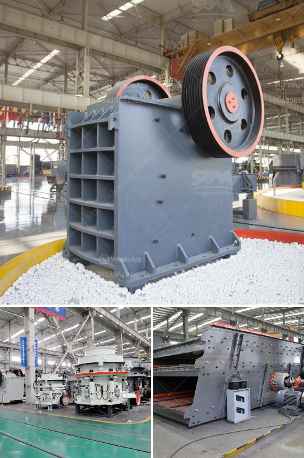

<h3>crusher plant in pakistan</h3>
Crusher plant in Pakistan is essential for both the construction industry and the mining industry. It is used for crushing stones and rocks into gravel, aggregate, etc. There are various types of crushing plants, depending on the input size, output size, and the material being crushed. These plants are commonly used in the construction, mining, and recycling industries.

The process of crushing involves multiple stages, including primary, secondary, and tertiary crushing. In the primary stage, jaw crushers or gyratory crushers are used to reduce the size of the rocks. The rock is then transported to the secondary crusher, usually a cone crusher, where it is further reduced in size. Finally, in the tertiary stage, the material is shaped into its final size and used for construction purposes or other applications.

Crusher plants in Pakistan are equipped with a variety of screening and conveying equipment, including vibrating screens, belt conveyors, and grizzly feeders. Once the raw material is crushed, it is then conveyed or screened to separate the desired product from the undesired material. This ensures that the final product meets the required specifications.

The crusher plants in Pakistan are designed to be efficient and productive, providing high-quality aggregates for various applications. They have a low operating cost and can be easily transported from one location to another. This flexibility allows for easy deployment at different construction sites or mining operations.

Furthermore, crusher plants in Pakistan are environmentally friendly. They are equipped with dust suppression systems to minimize the dust generated during the crushing process. In addition, modern crusher plants are often equipped with advanced technologies, such as automation and remote control, to enhance efficiency and reduce human intervention.

In conclusion, crusher plants in Pakistan play a crucial role in the construction and mining industries. They are designed to crush various types of rocks into gravel, aggregate, or other construction materials. These plants are efficient, productive, and environmentally friendly, making them essential for the infrastructure development of Pakistan.
<h3>Contact us</h3><ul><li><strong>Whatsapp:&nbsp;<a href="https://wa.me/8613661969651">+8613661969651</a></strong></li><li><a href="https://swt.shibang-china.com/?git&amp;zhl&amp;crusher plant in pakistan"><strong>Online Service(chat now)</strong></a></li></ul><h3>Related</h3><ul><li><a href='flowsheet for crushing plant.md'>flowsheet for crushing plant</a></li><li><a href='quarry business plan sample.md'>quarry business plan sample</a></li><li><a href='graphite beneficiation process.md'>graphite beneficiation process</a></li><li><a href='crusher 40 ton per jam.md'>crusher 40 ton per jam</a></li><li><a href='used stone crusher in europe for sale.md'>used stone crusher in europe for sale</a></li></ul>