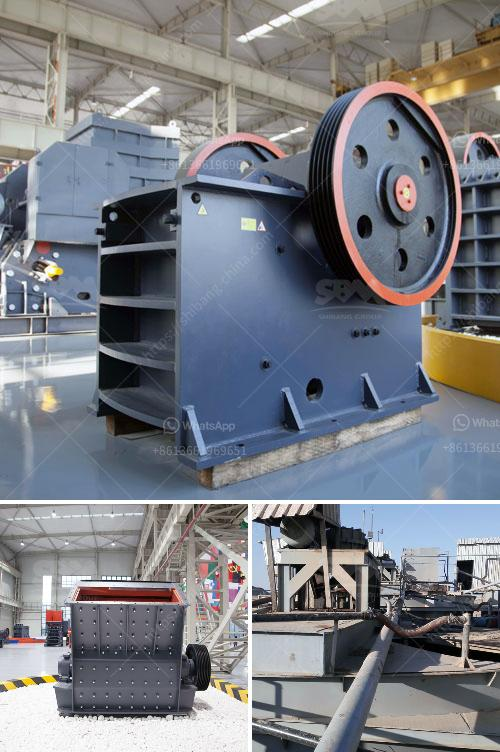

<h3>crusher plant in rajasthan</h3>
Crusher plant in Rajasthan is one of the key components of the mining industry. Whether it is limestone, granite or any other kind of stone, crushing is vital to the extraction of minerals and other materials. There are various types of crushers available for different applications, including jaw crushers, cone crushers, impact crushers and roll crushers, among others.

Rajasthan is known for its rich mineral reserves, particularly in the fields of marble and granite. The state has witnessed a surge in mining activities in recent years, leading to the establishment of numerous crusher plants in the region. These plants are crucial for the mining industry as they help in the processing and crushing of raw materials extracted from the mines.

Crusher plants in Rajasthan primarily serve the construction industry and support the production of cement, asphalt, aggregates, and various other materials required for construction projects. The demand for crushed stone in the state is highly-dynamic and constantly growing. Crusher plants play a crucial role in meeting the supply and demand of construction materials.

One of the key advantages of crusher plants in Rajasthan is that they are strategically located near the demand centers and mining sites. This ensures a steady supply of raw materials to the crusher plants and enables efficient transportation of the crushed products to the market. Additionally, crusher plants employ skilled workers who are trained in the handling and operation of crushers, ensuring high-quality output.

The process of crushing involves feeding the raw materials into the crushers, which are then gradually broken down into smaller pieces. The crushers use a combination of force, compression, and impact to achieve the desired size reduction. Once the materials are crushed, they are then screened to separate the different sizes of particles. The screened materials are then transported to the market or used in various construction projects.

Crusher plants in Rajasthan are equipped with advanced technologies that enhance their efficiency and productivity. They are designed to handle large quantities of raw materials and deliver the finished products in the shortest possible time. Some crusher plants are even equipped with automated systems that regulate the production process, ensuring consistent quality and minimizing human errors.

However, it is important to note that the establishment of crusher plants in Rajasthan has raised concerns about the impact on the environment. The mining and crushing activities generate dust, noise, and air pollution, which can have adverse effects on the health of the workers and the residents living in the vicinity. To address these concerns, the government has implemented strict regulations and guidelines for crusher plants to minimize their environmental impact.

In conclusion, crusher plants in Rajasthan are an integral part of the mining industry and play a crucial role in fulfilling the growing demand for construction materials. They are strategically located near the mining sites and demand centers, ensuring a steady supply of raw materials and efficient transportation of the crushed products. While crusher plants provide numerous benefits to the economy, it is equally important to monitor and minimize their environmental impact to protect the health and well-being of the workers and the residents living nearby.
<h3>Contact us</h3><ul><li><strong>Whatsapp:&nbsp;<a href="https://wa.me/8613661969651">+8613661969651</a></strong></li><li><a href="https://swt.shibang-china.com/?git&amp;zhl&amp;crusher plant in rajasthan"><strong>Online Service(chat now)</strong></a></li></ul><h3>Related</h3><ul><li><a href='companies manufacturing quarry plant in uk.md'>companies manufacturing quarry plant in uk</a></li><li><a href='portable rock crusher rental.md'>portable rock crusher rental</a></li><li><a href='how to start a coal mine.md'>how to start a coal mine</a></li><li><a href='limestone impact crusher wobbler.md'>limestone impact crusher wobbler</a></li><li><a href='mobile screening plant.md'>mobile screening plant</a></li></ul>