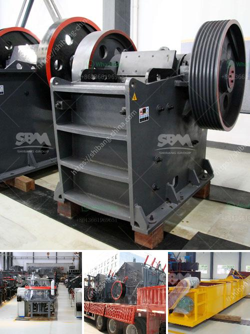

<h3>crusher plant in rayagada orissa</h3>
Crusher industries in Rayagada, Odisha are rapidly transforming into a multi-million dollar industry in recent years, thanks to the continuous growth of infrastructure development efforts in the state.

Investors pouring money into the region's newest and most prestigious crusher plants are expecting a surge in demand in the near future, mainly due to the opportunity for building materials used for construction purposes. This has led to massive investments in the establishment of these plants in Rayagada and its surrounding areas, in order to capitalize on the growing demand.

The crusher plant in Rayagada, Odisha is a state-of-the-art facility that is equipped with the latest technology available in the market. For the production of high quality aggregates, it uses the Metso Non-Stop System (NSS) technology, which ensures uninterrupted, consistent stone flow to the crusher. The plant is also equipped with a 3-decked sieving system, which enables it to produce different types of aggregates simultaneously.

The crusher plants in Rayagada, Odisha, are characterized by their high efficiency, low operational cost, easy maintenance, and long service life. The crusher plant, therefore, has a high investment and operating cost, which is justified by the numerous advantages it offers.

The crusher plants in Rayagada, Odisha, are equipped with dust extraction systems to keep the environment pollution-free. Dust suppression systems are installed to prevent any dust generation during the process. Water sprinklers are also provided to suppress any dust that may escape from the crusher plant.

With the establishment of these modern crusher plants, producers have ensured a steady supply of high-quality stone chips and other materials essential for construction projects in the region. These crusher plants supply more than just stone chips; they provide a solution to the growing demand for building materials.

The crusher plant industry in Rayagada, Odisha holds immense potential for future growth. The upcoming infrastructure development projects in the state will undoubtedly drive the demand for stone chips and other aggregate materials. This is further bolstered by the state government's push towards the expansion of highways, construction of bridges, and other key projects.

The crusher plant industry not only directly benefits the construction industry but also indirectly supports other sectors of the economy. It creates employment opportunities for the local workforce, as both skilled and unskilled labor are required for the operation and maintenance of these plants. The revenue generated from the crusher plant industry also contributes to the economic development of the region.

However, it is important to note that the crusher plants should operate within the environmental regulations set by the government. Strict monitoring and periodic inspections should be conducted to ensure the crusher plants are functioning in an environmentally sustainable manner and do not pose any threat to the health of the workforce and nearby communities.

In conclusion, the establishment of crusher plants in Rayagada, Odisha plays a vital role in meeting the demands of the construction industry. These plants ensure a continuous supply of high-quality stone chips and other building materials, contributing to the growth and development of the region. With the increasing investment in the crusher plant industry, Rayagada, Odisha is poised to become a major hub for the production of stone chips in the state.
<h3>Contact us</h3><ul><li><strong>Whatsapp:&nbsp;<a href="https://wa.me/8613661969651">+8613661969651</a></strong></li><li><a href="https://swt.shibang-china.com/?git&amp;zhl&amp;crusher plant in rayagada orissa"><strong>Online Service(chat now)</strong></a></li></ul><h3>Related</h3><ul><li><a href='crushed stone prices per ton.md'>crushed stone prices per ton</a></li><li><a href='gypsum bord plant factorie price.md'>gypsum bord plant factorie price</a></li><li><a href='crushers and wash plant processes.md'>crushers and wash plant processes</a></li><li><a href='closing of crushing plant.md'>closing of crushing plant</a></li><li><a href='business plan template for cement plant.md'>business plan template for cement plant</a></li></ul>