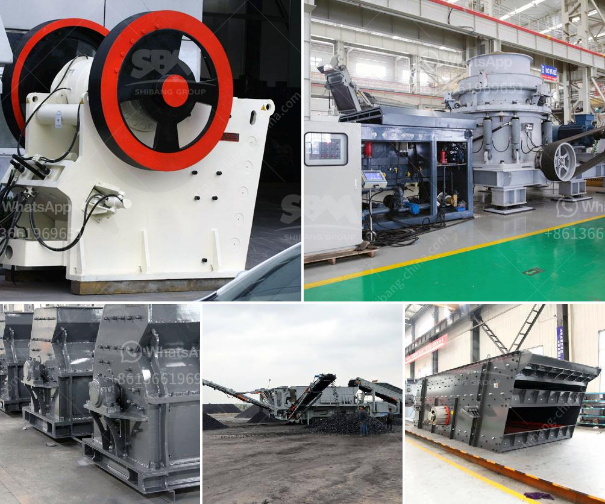

<h3>crusher plant sale</h3>
Mining operations are often complex undertakings that require specialized equipment to properly extract, crush, and transport minerals and precious metals. Without the right machinery, the process can be time-consuming and inefficient, resulting in higher costs and lower profit margins. This is where crusher plants come into play.

A crusher plant is a machine designed to reduce the size of large rocks or gravel particles into smaller rocks, gravel, or dust. These machines are usually used to deal with raw materials such as granite, limestone, river gravel, basalt, quartz, sandstone, and dolomite. Once the material is processed, it can be used for construction purposes, such as making concrete and asphalt, or for various other industrial applications.

For mining companies, having a crusher plant on-site can potentially save them time, money, and resources. Instead of transporting raw materials to remote locations, they can simply gather them at the mining site and process them on the spot. This not only eliminates transportation costs but also reduces the risk of material loss or damage during transit.

Furthermore, crusher plants allow mining companies to control and optimize the quality of the materials being produced. They can adjust the size of the output material based on specific requirements, ensuring that it meets industry standards and customer specifications. By being able to produce materials of consistent quality, mining companies can establish a reputation for excellence, attracting more customers and increasing their market share.

In recent years, there has been a surge in crusher plant sales due to the growing demand for construction materials and the subsequent increase in mining activities. To meet this demand, manufacturers have been introducing innovative features and technologies to improve overall efficiency and productivity. This includes advanced control systems, automated processes, and eco-friendly designs that minimize environmental impact.

When considering a crusher plant purchase, mining companies should assess their specific needs and prioritize certain characteristics. Factors such as production capacity, energy consumption, maintenance requirements, and operational costs should be taken into account. It is also essential to choose a reputable manufacturer with a proven track record in the industry and offers reliable after-sales service and technical support.

Overall, a crusher plant sale offers mining companies an excellent opportunity to streamline their operations, enhance productivity, and ultimately increase profitability. By investing in the right machinery, companies can ensure that their mining process is efficient, cost-effective, and environmentally sustainable. Additionally, having a crusher plant on-site allows for greater control over production quality, enabling mining companies to meet the demands of their customers and stay ahead of the competition.

In conclusion, the sale of crusher plants can greatly benefit the mining industry by providing practical and efficient solutions for material processing. By investing in these machines, mining companies can optimize their operations, reduce costs, and increase their overall profitability. It is a timely opportunity that should not be overlooked by any serious player in the mining sector.
<h3>Contact us</h3><ul><li><strong>Whatsapp:&nbsp;<a href="https://wa.me/8613661969651">+8613661969651</a></strong></li><li><a href="https://swt.shibang-china.com/?git&amp;zhl&amp;crusher plant sale"><strong>Online Service(chat now)</strong></a></li></ul><h3>Related</h3><ul><li><a href='sand maker machines.md'>sand maker machines</a></li><li><a href='mining processing machine supplier companies in pakistan.md'>mining processing machine supplier companies in pakistan</a></li><li><a href='coal crushing process.md'>coal crushing process</a></li><li><a href='gyratory crusher harga.md'>gyratory crusher harga</a></li><li><a href='used small rotary kiln price russia.md'>used small rotary kiln price russia</a></li></ul>