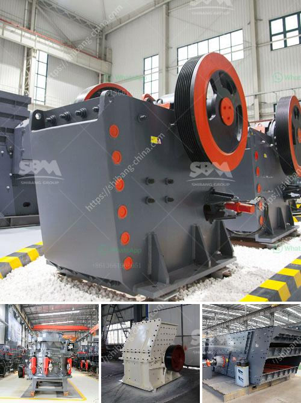

<h3>crusher price in malaysia stones</h3>
Malaysia, a Southeast Asian country, is known for its diverse culture, mesmerizing beaches, and stunning landscapes. However, beneath its natural beauty lies a well-developed infrastructure and booming construction industry. As these industries thrive, the demand for crushed stones has also surged, making crushers an essential tool for various construction projects. Here, we delve into the factors influencing the price of crushers in Malaysia's stone market.

The price of crushers varies depending on a multitude of factors, including the type of crusher, its capacity, brand, and additional features. In Malaysia, there are various types of crushers available, such as jaw crushers, cone crushers, impact crushers, and many more. Each type caters to specific needs and comes with a different price tag.

Jaw crushers, for instance, are commonly used in primary crushing operations, where large rocks are reduced into smaller sizes. They are known for their simple structure, high productivity, and low operational costs. The price of a jaw crusher in Malaysia starts from a few thousand Malaysian Ringgit (MYR) and can go up to hundreds of thousands of MYR, depending on the brand and capacity.

On the other hand, cone crushers are more suitable for secondary and tertiary crushing tasks. These machines excel in producing finer and more uniform particles. Compared to jaw crushers, they are usually priced slightly higher due to their advanced features and capabilities.

Another crucial factor in determining crusher prices is the capacity of the machine. Higher capacity crushers can process more materials within a specific timeframe, making them ideal for large-scale construction projects. However, the larger the capacity, the higher the price. A crusher with a higher capacity can cost significantly more, reflecting the added engineering and manufacturing efforts required to produce such machines.

Furthermore, the brand of the crusher also influences its price. Well-established and renowned brands often come with a premium price due to their reputation for producing reliable and durable products. Smaller or lesser-known brands might offer crushers at a more economical price, but the quality and longevity may vary.

In addition to these factors, any extra features and accessories added to the crusher can also affect its price. Some crushers come with additional safety features, automated controls, or energy-saving mechanisms. While these features contribute to the overall efficiency and convenience of the crusher, they come at an additional cost.

It is worth mentioning that the price of crushers can be influenced by market trends, global economic factors, and even currency fluctuations. For instance, if there is a sudden surge in demand for crushers or scarcity of raw materials used in their manufacturing, the price can rise.

In summary, the price of crushers in Malaysia's stone market is contingent on various factors, such as the type, capacity, brand, and additional features of the crusher. Furthermore, market trends and economic conditions can also impact their pricing. As a potential buyer, it is crucial to assess your specific requirements, budget, and long-term goals before investing in a crusher that aligns with your needs. By doing so, you can find a crusher at an affordable price without compromising on quality and performance to meet Malaysia's growing demand for crushed stones.
<h3>Contact us</h3><ul><li><strong>Whatsapp:&nbsp;<a href="https://wa.me/8613661969651">+8613661969651</a></strong></li><li><a href="https://swt.shibang-china.com/?git&amp;zhl&amp;crusher price in malaysia stones"><strong>Online Service(chat now)</strong></a></li></ul><h3>Related</h3><ul><li><a href='harga mesin ball mill.md'>harga mesin ball mill</a></li><li><a href='difference between pebble and stone.md'>difference between pebble and stone</a></li><li><a href='coal crushing plant for sale in south africa.md'>coal crushing plant for sale in south africa</a></li><li><a href='stone crushing equipment available in northern cape.md'>stone crushing equipment available in northern cape</a></li><li><a href='cost of building calcium carbonate factory.md'>cost of building calcium carbonate factory</a></li></ul>