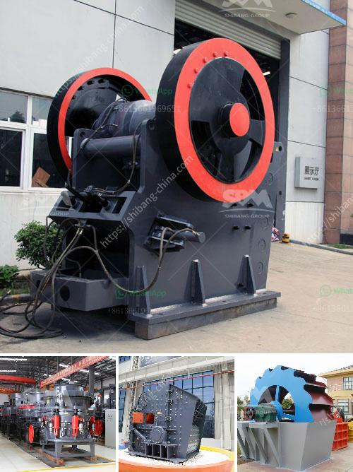

<h3>crusher price in philippines</h3>
The Philippines is known for its rich mineral resources, with reserves ranked among the world's top ten. The country has vast deposits of metallic and non-metallic minerals, such as gold, copper, iron ore, nickel, limestone, and granite. To fully utilize these resources, mining companies need the right equipment to efficiently extract and process these minerals. One such essential equipment is the crusher, which is used to transform large rocks and stones into smaller particles for further processing.

The price of crushers in the Philippines varies greatly depending on the type and capacity. The commonly used types are jaw crushers, impact crushers, and cone crushers. Jaw crushers are designed to crush the toughest materials, such as granite and basalt. Meanwhile, impact crushers are utilized for the processing of softer materials like limestone.

When considering the price of a crusher in the Philippines, several factors come into play. The brand reputation, quality, and after-sales service are among the crucial factors that potential buyers should consider. Reputable brands often come at a higher price, but they provide assurance of durability and reliability. Moreover, these brands typically offer better after-sales service, including warranties and readily available spare parts.

Capacity is also a significant factor in determining the price. Crushers with higher capacity are, naturally, priced higher than crushers with smaller capacity. However, it is essential to select a capacity that matches the buyer's specific needs. Overspending on a high-capacity crusher that exceeds what is necessary can be an inefficient use of financial resources.

Another factor affecting the price of crushers in the Philippines is the source of raw materials. Since raw materials are required for manufacturing crushers, their availability and cost significantly impact the final price. For instance, imported crushers may be more expensive due to transportation and importation costs. On the other hand, locally manufactured crushers may have a competitive price advantage.

Additionally, demand and competition in the market also influence crusher prices in the Philippines. If the demand for crushers is high, prices are likely to rise. Conversely, if the market is highly competitive with several manufacturers offering similar products, there may be a downward pressure on prices.

A significant advantage for customers in the Philippines is the availability of flexible payment terms. Many sellers offer financing options, allowing buyers to pay in installments instead of full upfront payment. This provides more affordability and accessibility to a wider range of customers.

To effectively determine the crusher price in the Philippines, it is crucial to conduct thorough research and explore different options. Buyers should compare prices, features, and after-sales service offered by various brands. Seeking recommendations from industry experts or experienced users can also provide valuable insights.

In conclusion, the price of crushers in the Philippines is influenced by several factors, including brand reputation, quality, capacity, source of raw materials, demand, and competition. By carefully considering these factors and conducting extensive research, potential buyers can find a crusher that meets their requirements while also obtaining the best value for their investment.
<h3>Contact us</h3><ul><li><strong>Whatsapp:&nbsp;<a href="https://wa.me/8613661969651">+8613661969651</a></strong></li><li><a href="https://swt.shibang-china.com/?git&amp;zhl&amp;crusher price in philippines"><strong>Online Service(chat now)</strong></a></li></ul><h3>Related</h3><ul><li><a href='komatsu mobile crushers price.md'>komatsu mobile crushers price</a></li><li><a href='price stone crusher dragon.md'>price stone crusher dragon</a></li><li><a href='stone crusher machine assembling flow chart.md'>stone crusher machine assembling flow chart</a></li><li><a href='mineral plant bauxite ore crushing plant.md'>mineral plant bauxite ore crushing plant</a></li><li><a href='manufacturer of industrial hammer mill.md'>manufacturer of industrial hammer mill</a></li></ul>