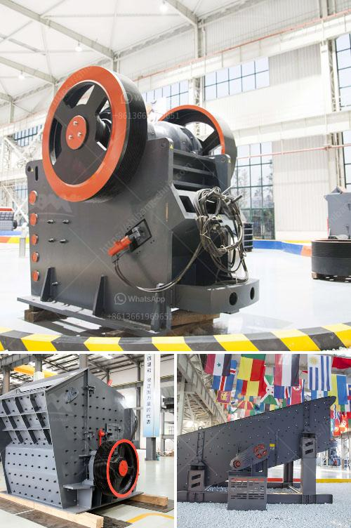

<h3>crusher primary mobile crusher</h3>
The primary mobile crusher, also known as a jaw crusher, is designed to reduce large rocks into smaller particles for further processing in the mining and construction industries. The unique design allows this equipment to be used in various fields of application, such as road construction, mining and quarrying, demolition and recycling.

One of the key features of the primary mobile crusher is its versatility. It can be used as a standalone unit or combined with other equipment to form a complete crushing and screening plant. This flexibility ensures that operators can adapt the crusher to specific job requirements, allowing for efficient and cost-effective operations.

One of the main advantages of using a primary mobile crusher is its mobility. It can be easily transported from one site to another, reducing the need for expensive transportation equipment. This mobility also allows for quick setup and dismantling of the crusher, minimizing the downtime and maximizing productivity.

Another significant benefit of the primary mobile crusher is its high capacity. With its powerful jaw crusher, it can handle even the toughest materials and process them efficiently. This enables operators to achieve higher production rates and meet demanding project requirements.

In addition to its robust construction and reliable performance, the primary mobile crusher is also designed with operator safety in mind. It is equipped with safety features such as remote operation capability, emergency stop buttons, and advanced control systems to ensure safe and efficient operation.

In summary, the primary mobile crusher is a versatile and efficient piece of equipment that offers numerous benefits in the mining and construction industries. Its mobility, high capacity, and safety features make it an ideal choice for various applications. Whether used on its own or in conjunction with other equipment, this crusher ensures cost-effective and productive operations for operators.
<h3>Contact us</h3><ul><li><strong>Whatsapp:&nbsp;<a href="https://wa.me/8613661969651">+8613661969651</a></strong></li><li><a href="https://swt.shibang-china.com/?git&amp;zhl&amp;crusher primary mobile crusher"><strong>Online Service(chat now)</strong></a></li></ul><h3>Related</h3><ul><li><a href='stone hammer mills in china.md'>stone hammer mills in china</a></li><li><a href='used stone crushers for sale india.md'>used stone crushers for sale india</a></li><li><a href='price ball mill 40tph.md'>price ball mill 40tph</a></li><li><a href='dolomite powder mill manufacturing process.md'>dolomite powder mill manufacturing process</a></li><li><a href='cost of limestone powder crushing machine.md'>cost of limestone powder crushing machine</a></li></ul>