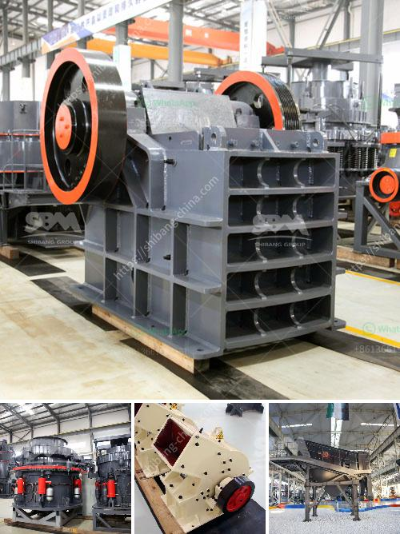

<h3>crusher rock for sale</h3>
Crusher rock is a versatile material that is commonly used for various landscaping purposes. It can be used as a base material for driveways, patios, and walkways, as well as for creating borders and retaining walls. As its name suggests, crusher rock is produced by crushing larger rocks into smaller pieces. It comes in various sizes, ranging from fine dust particles to larger stones.

One of the major advantages of using crusher rock is its durability. Since it is made from rocks, it is extremely tough and able to withstand heavy weight and pressure. This makes it an ideal choice for areas that experience a lot of traffic, such as driveways and pathways. It also helps prevent erosion and can effectively stabilize the ground beneath it.

Another benefit of using crusher rock is its aesthetic appeal. The crushed stones come in different colors and textures, allowing for creative design options. Whether you are looking for a natural, rustic look or a more modern and sleek appearance, there are crusher rocks available to suit your style and preference.

Furthermore, crusher rock is an eco-friendly choice for landscaping. By reusing and recycling larger rocks, it helps reduce the need for mining or extracting new materials from the earth. This contributes to the conservation of natural resources and helps minimize the carbon footprint associated with the production and transportation of construction materials.

When purchasing crusher rock for sale, it is important to consider the specific needs of your project. Determine the size and quantity of rocks required, as well as any specific color or texture preferences. Additionally, consider the delivery options provided by the supplier and whether they can accommodate your timeline.

Before making a purchase, always ensure that the supplier is reputable and provides high-quality materials. Check for customer reviews and testimonials to ensure their satisfaction with the products and services provided. Additionally, inquire about any warranties or guarantees provided by the supplier to ensure that you will receive the desired quality and quantity of crusher rock.

Once you have selected your crusher rock and it has been delivered, it is important to properly prepare the area before installation. Remove any existing vegetation, debris, or obstacles, and ensure that the ground is adequately leveled. Depending on the intended use, you may need to install a geotextile fabric or a layer of crushed gravel as a base before laying the crusher rock.

In conclusion, crusher rock for sale is a versatile and durable landscaping material that offers numerous benefits. From its durability and aesthetic appeal to its eco-friendly nature, crusher rock is a worthy investment for any landscaping project. When purchasing crusher rock, always consider the specific needs of your project and choose a reputable supplier to ensure high-quality products and services.
<h3>Contact us</h3><ul><li><strong>Whatsapp:&nbsp;<a href="https://wa.me/8613661969651">+8613661969651</a></strong></li><li><a href="https://swt.shibang-china.com/?git&amp;zhl&amp;crusher rock for sale"><strong>Online Service(chat now)</strong></a></li></ul><h3>Related</h3><ul><li><a href='sewa mobile stone crusher di indonesia.md'>sewa mobile stone crusher di indonesia</a></li><li><a href='clinker crsher plant for sale.md'>clinker crsher plant for sale</a></li><li><a href='slag crushing plant manufacturers in india.md'>slag crushing plant manufacturers in india</a></li><li><a href='sand making machine zenith.md'>sand making machine zenith</a></li><li><a href='quarry jaw crusher.md'>quarry jaw crusher</a></li></ul>