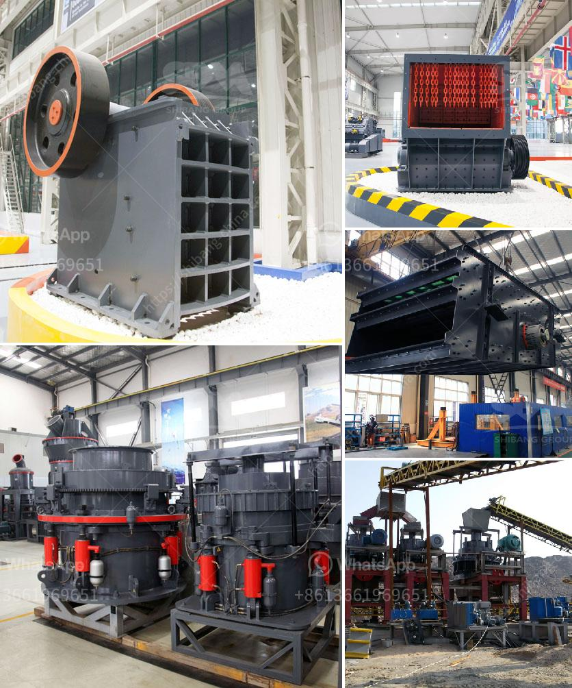

<h3>crusher sand washing machines for crusher nepal</h3>
Crusher sand washing machines have emerged as a key equipment in many industries worldwide. These machines are known for their innovative features and efficient performance. With the increasing demand for sand as a necessary construction material, crusher sand washing machines are vital for providing a clean and high-quality sand product.

In crusher Nepal, the use of crusher sand washing machines has gained momentum over the years. These machines are primarily used to wash sand and remove impurities such as dust, dirt, and debris. They are equipped with a vibrating feeder, jaw crusher, sand making machine or cone crusher, vibrating screen, and belt conveyor. The entire process ensures the production of a clean and uniform sand product that meets the required specifications.

The crusher sand washing machines in Nepal are designed with advanced technology, enabling easy operation and maintenance. They have a robust construction that ensures long-lasting performance even in harsh working conditions. The machines are also equipped with efficient motor systems that deliver high power and reduce energy consumption, making them environmentally friendly.

One of the key benefits of using crusher sand washing machines is the significant improvement in the quality of the sand produced. The removal of impurities results in a sand product with consistent gradation and reduced levels of silt and clay content. This makes it ideal for use in various construction applications such as concrete production, road building, and landscaping projects.

Additionally, crusher sand washing machines enhance the overall efficiency of the crushing process. By removing the impurities, the machines allow for better crushing and screening performance, leading to increased productivity and reduced downtime. Moreover, the uniform sand product can significantly improve the strength and durability of the final construction materials.

In conclusion, crusher sand washing machines have become an essential equipment in the crusher industry in Nepal. Their ability to wash sand and remove impurities ensures the production of a clean and high-quality sand product. With their advanced technology and robust construction, these machines offer efficiency, durability, and environmental sustainability. As the demand for sand continues to rise, crusher sand washing machines play a vital role in meeting the requirements of various construction projects.
<h3>Contact us</h3><ul><li><strong>Whatsapp:&nbsp;<a href="https://wa.me/8613661969651">+8613661969651</a></strong></li><li><a href="https://swt.shibang-china.com/?git&amp;zhl&amp;crusher sand washing machines for crusher nepal"><strong>Online Service(chat now)</strong></a></li></ul><h3>Related</h3><ul><li><a href='silica sand manufacturing process.md'>silica sand manufacturing process</a></li><li><a href='flow chart for gold extraction from ores.md'>flow chart for gold extraction from ores</a></li><li><a href='aggregate washing plant saudi arabia.md'>aggregate washing plant saudi arabia</a></li><li><a href='gypsum plant equipment catalogue.md'>gypsum plant equipment catalogue</a></li><li><a href='river pebble crusher supplier.md'>river pebble crusher supplier</a></li></ul>