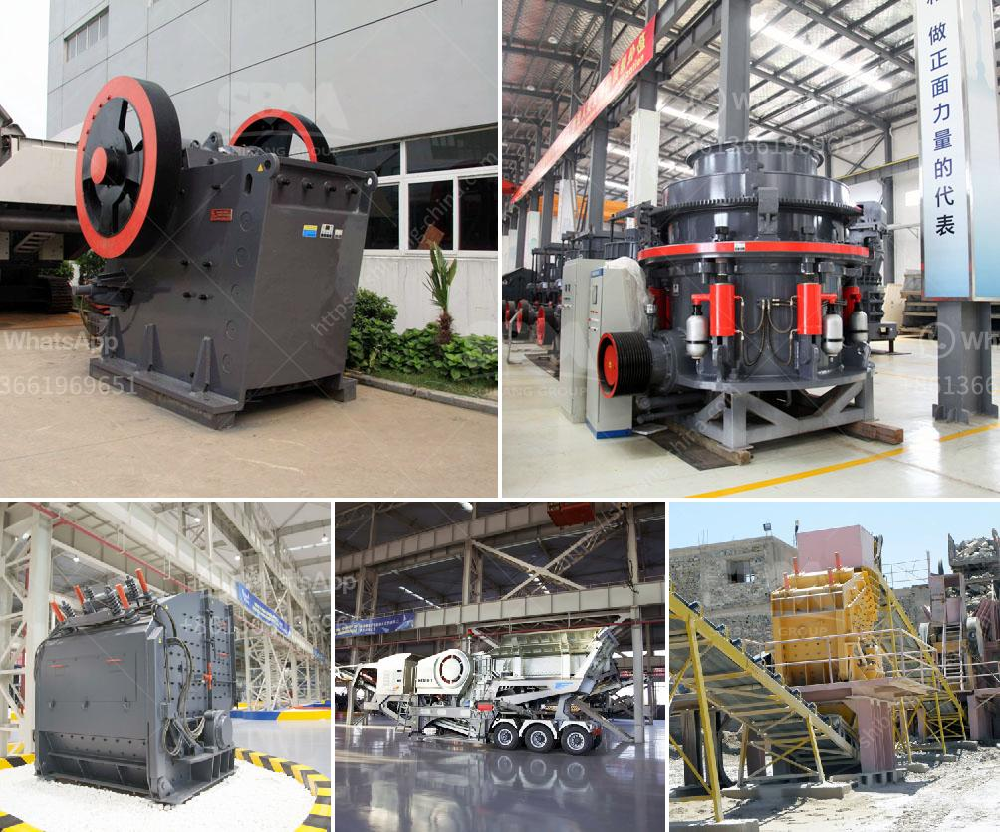

<h3>crusher stone crusher 4 ton</h3>
Crushing equipment plays a crucial role in the process of reducing the size of larger rocks and stones into smaller pieces for further utilization. Stone crushers have become an essential part of modern civilization and are widely used in mining, construction, and various other industries. One such powerful machine is the crusher stone crusher 4 ton.

The crusher stone crusher 4 ton is a versatile machine that simplifies the crushing process. It can be mounted on a wheeled trailer or be self-propelled on caterpillar treads. Its autonomy and mobility enable it to crush rocks in difficult-to-reach areas. This powerful machine is designed to handle all kinds of materials, including hard, abrasive stones.

One of the most significant benefits of the crusher stone crusher 4 ton is its ability to produce a consistent and uniform product size. The machine incorporates a powerful jaw crusher that effortlessly breaks down rocks into smaller pieces. This ensures that the resulting crushed material is of the desired size, which is critical for many applications.

In the construction industry, the crusher stone crusher 4 ton is widely used in the production of aggregates, such as sand, gravel, and crushed stone. These materials are essential for creating a solid foundation for roads, buildings, and other infrastructures. The consistent size of the crushed material ensures the uniformity and stability of the final product.

Another area where the crusher stone crusher 4 ton excels is in the mining industry. It is often used to process various types of ore, such as gold, silver, copper, and iron. These ores need to be crushed to a specific size before they can be further processed using other mining equipment. The crusher stone crusher 4 ton efficiently reduces the massive ore into smaller particles, making it easier to extract valuable minerals from the rock.

Agriculture is another sector that benefits from the crusher stone crusher 4 ton. Farmers often need to crush rocks and stones in their fields to facilitate cultivation or create drivable pathways. The machine's compact design allows it to maneuver easily through agricultural terrain, making it an ideal choice for such applications.

The crusher stone crusher 4 ton is also equipped with advanced technology that enhances its performance and efficiency. It features a hydraulic system that allows for easy adjustment of the crusher's settings, ensuring optimal crushing performance and minimizing downtime. Additionally, the machine is equipped with a dust suppression system that reduces the release of harmful dust particles into the environment.

In summary, the crusher stone crusher 4 ton is a powerful machine that is revolutionizing the crushing industry. Its ability to produce consistent and uniform product sizes makes it an invaluable tool in various sectors, including construction, mining, and agriculture. With its advanced technology and versatility, this machine sets new standards in crushing equipment. Investing in a crusher stone crusher 4 ton will undoubtedly enhance productivity, improve efficiency, and contribute to the overall success of any project or operation.
<h3>Contact us</h3><ul><li><strong>Whatsapp:&nbsp;<a href="https://wa.me/8613661969651">+8613661969651</a></strong></li><li><a href="https://swt.shibang-china.com/?git&amp;zhl&amp;crusher stone crusher 4 ton"><strong>Online Service(chat now)</strong></a></li></ul><h3>Related</h3><ul><li><a href='gypsum vibrating screen.md'>gypsum vibrating screen</a></li><li><a href='list of mini cement plants in gujarat.md'>list of mini cement plants in gujarat</a></li><li><a href='coal crushing process.md'>coal crushing process</a></li><li><a href='marble crushing machinery.md'>marble crushing machinery</a></li><li><a href='quartz manufacturing process.md'>quartz manufacturing process</a></li></ul>