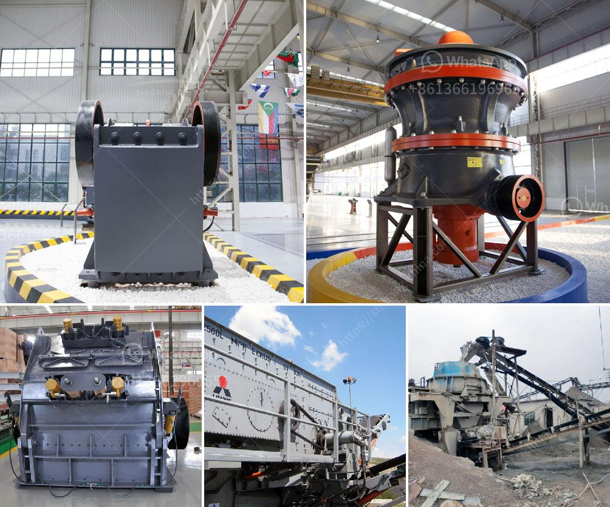

<h3>crusher stone durban</h3>
Crushed stone is a versatile material used for many purposes in construction and landscaping projects. One of the most popular uses of crushed stone is in the production of concrete. It provides strength and durability to the final product, ensuring that it can withstand heavy loads and harsh weather conditions. In the coastal city of Durban, South Africa, crusher stone is a widely used material for construction due to its affordability and versatility.

Durban, known for its beautiful beaches and warm climate, experiences a high demand for construction materials. The city is constantly growing and developing, with new buildings and infrastructure projects popping up all the time. Crusher stone in Durban plays a crucial role in meeting this demand by providing a reliable and cost-effective material for construction projects.

One of the main advantages of using crusher stone in Durban is its affordability. Compared to other construction materials, such as bricks or concrete blocks, crusher stone is significantly cheaper. This makes it a popular choice for contractors and homeowners who are working on a tight budget. By using crusher stone, they can save money without compromising on the quality and durability of their construction projects.

Another advantage of crusher stone in Durban is its versatility. It can be used for a wide range of applications, such as road base, driveways, pathways, and as a base material for patios and other outdoor spaces. Its small size and irregular shape allow it to compact tightly, providing a stable and durable surface. This makes it ideal for areas that experience heavy traffic or require drainage, as it allows water to flow through without eroding the surface.

Furthermore, crusher stone in Durban is available in different sizes and grades to suit various construction needs. The most commonly used sizes are 13mm and 19mm, but smaller and larger sizes are also available. This allows contractors to select the right type of crusher stone for their specific project requirements.

In addition to its affordability, versatility, and availability, crusher stone in Durban is also environmentally friendly. It is a recycled material, made from crushed concrete and demolished building materials. By reusing these materials, the demand for natural resources is reduced, contributing to a more sustainable construction industry.

However, like any construction material, crusher stone in Durban also has its limitations. It is not recommended for areas with heavy clay content, as it can lead to poor drainage and inadequate compaction. Additionally, it may not be suitable for projects that require a perfectly smooth or uniform finish, as its irregular shape can create a slightly rough surface.

In conclusion, crusher stone in Durban is an essential material for construction projects in the city. Its affordability, versatility, and environmentally friendly nature make it a popular choice among contractors and homeowners. Whether used as a base material, for drainage, or for creating stable surfaces, crusher stone provides strength and durability to ensure long-lasting structures. So the next time you're planning a construction project in Durban, consider using crusher stone for a cost-effective and reliable solution.
<h3>Contact us</h3><ul><li><strong>Whatsapp:&nbsp;<a href="https://wa.me/8613661969651">+8613661969651</a></strong></li><li><a href="https://swt.shibang-china.com/?git&amp;zhl&amp;crusher stone durban"><strong>Online Service(chat now)</strong></a></li></ul><h3>Related</h3><ul><li><a href='price stone crusher dragon.md'>price stone crusher dragon</a></li><li><a href='ballast crushing machine kenya.md'>ballast crushing machine kenya</a></li><li><a href='prices on cone crusher parts.md'>prices on cone crusher parts</a></li><li><a href='granite quarrying companies.md'>granite quarrying companies</a></li><li><a href='dolomite powder mill manufacturing process.md'>dolomite powder mill manufacturing process</a></li></ul>