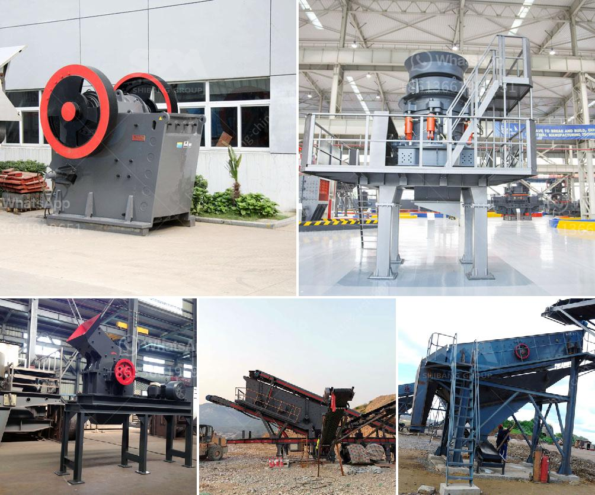

<h3>crusher stone for sale gauteng</h3>
Crusher stone for sale Gauteng, also known as "crusher run", is a type of gravel that is commonly used in places where motor vehicles are often driven or parked. Crushed stone is typically graded to a certain size, such as 3/4", although finer grades can also be produced. It is made by mechanically crushing rocks, boulders, or large stones into smaller pieces.

Crusher stone is a versatile material that can be used for various purposes around residential, commercial, and industrial areas. Here are some common uses and benefits:

1. Driveways and Parking Areas: Due to its compact and sturdy nature, crusher stone is an ideal choice for creating driveways and parking areas. Its ability to withstand heavy loads from vehicles makes it highly durable and long-lasting.

2. Pathways and Walkways: Crusher stone is also commonly used for pathways and walkways in gardens, parks, and other outdoor areas. Its rough texture provides good traction, making it safe for pedestrians.

3. Landscaping: With its natural appearance and varied colors, crusher stone can enhance the aesthetics of any landscape design. It can be used to create borders, fill flower beds, or construct decorative features like garden walls.

4. Erosion Control: The hard surface of crusher stone helps to prevent soil erosion in areas prone to water run-off. It can be strategically placed on slopes or embankments to stabilize the soil and prevent land degradation.

5. Construction Projects: Crusher stone can be used as a base material for constructing buildings, roads, and other infrastructure. It provides a solid foundation that can withstand heavy loads and helps to distribute the weight evenly.

If you are looking for crusher stone for sale in Gauteng, look no further than local suppliers and quarries in the area. Depending on your specific needs, they will be able to provide you with the crusher stone that suits your requirements.

It is important to choose a reputable supplier that offers quality products at competitive prices. Consider asking for recommendations from friends, neighbors, or contractors who have previously purchased crusher stone. Reading online reviews and comparing prices from multiple suppliers can also help you make an informed decision.

Crusher stone for sale in Gauteng is a practical and cost-effective solution for a wide range of applications. Whether you need to create driveways, pathways, or stabilize soil, crusher stone can offer durability and versatility. By choosing a reliable supplier, you can ensure the quality and consistency of the product, thus adding value to your projects.
<h3>Contact us</h3><ul><li><strong>Whatsapp:&nbsp;<a href="https://wa.me/8613661969651">+8613661969651</a></strong></li><li><a href="https://swt.shibang-china.com/?git&amp;zhl&amp;crusher stone for sale gauteng"><strong>Online Service(chat now)</strong></a></li></ul><h3>Related</h3><ul><li><a href='cost of coal washing plant.md'>cost of coal washing plant</a></li><li><a href='quotes hammer mill.md'>quotes hammer mill</a></li><li><a href='mini mobile crusher plant for sale.md'>mini mobile crusher plant for sale</a></li><li><a href='jaw crusher for sale in nigeria.md'>jaw crusher for sale in nigeria</a></li><li><a href='iron processing equipment in mexico.md'>iron processing equipment in mexico</a></li></ul>