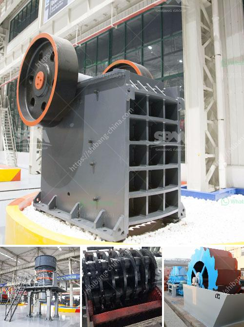

<h3>crushers and feeders in south africa</h3>
South Africa is known for its rich mineral resources and contributes significantly to the global mining industry. It is home to a vast array of minerals including precious metals, diamonds, coal, and iron ore, among others. The mining sector plays a crucial role in driving the country's economy, making infrastructure development an essential aspect to support this sector's growth.

Crushers and feeders are vital components in the mining process, responsible for the initial breaking down of raw materials before they are transported to the next stage. These machines play a significant role in improving the efficiency and productivity of mining operations in South Africa.

Crushers are used to reduce the size of large rocks and minerals into smaller, more manageable pieces. They come in various forms, such as jaw crushers, gyratory crushers, cone crushers, and impact crushers. Each type has its specific purpose and benefits, depending on the material being processed.

Jaw crushers are commonly used in primary crushing, where large rocks are broken down into smaller particles. Gyratory crushers, on the other hand, are mainly used for primary crushing in high-capacity mineral processing operations. Cone and impact crushers are versatile machines that can be used in both primary and secondary crushing. They are essential for reducing the size of materials for further processing and extraction.

Feeders, on the other hand, are used to regulate the flow of materials into crushers and other downstream equipment. They ensure a consistent and steady supply of material, preventing blockages and controlling the rate of feed into the processing plant. Feeders come in various forms, including apron feeders, vibrating grizzly feeders, and pan feeders, each serving different purposes based on the specific mining operation or process requirements.

In South Africa, the demand for crushers and feeders has grown significantly due to increased mining activities and the need to process minerals efficiently. The country's vast mineral resources attract both local and international mining companies, resulting in a growing need for infrastructure development.

The improved efficiency and productivity brought about by crushers and feeders contribute to the overall success of mining operations in South Africa. By ensuring a steady supply of materials with consistent sizes, crushers and feeders minimize downtime, reduce costs, and increase overall production rates.

Additionally, crushers and feeders contribute to the safety of mining operations. They enable the remote handling of materials, reducing the risks associated with manual handling and enhancing the safety of workers. By automating the feeding and crushing processes, mining companies can minimize exposure to hazardous conditions and improve overall workplace safety.

In conclusion, crushers and feeders are essential components of the mining industry in South Africa. They play a crucial role in breaking down raw materials, ensuring a steady supply of materials, and improving efficiency and productivity. As the demand for minerals continues to grow, crushers and feeders will remain vital in supporting infrastructure development and driving the success of the mining sector in South Africa.
<h3>Contact us</h3><ul><li><strong>Whatsapp:&nbsp;<a href="https://wa.me/8613661969651">+8613661969651</a></strong></li><li><a href="https://swt.shibang-china.com/?git&amp;zhl&amp;crushers and feeders in south africa"><strong>Online Service(chat now)</strong></a></li></ul><h3>Related</h3><ul><li><a href='crusher plant sale.md'>crusher plant sale</a></li><li><a href='conveyor belts supplier malaysia.md'>conveyor belts supplier malaysia</a></li><li><a href='list of gold refineries companies in uae.md'>list of gold refineries companies in uae</a></li><li><a href='limestone grinding mill german for sale.md'>limestone grinding mill german for sale</a></li><li><a href='california rock crusher machine.md'>california rock crusher machine</a></li></ul>