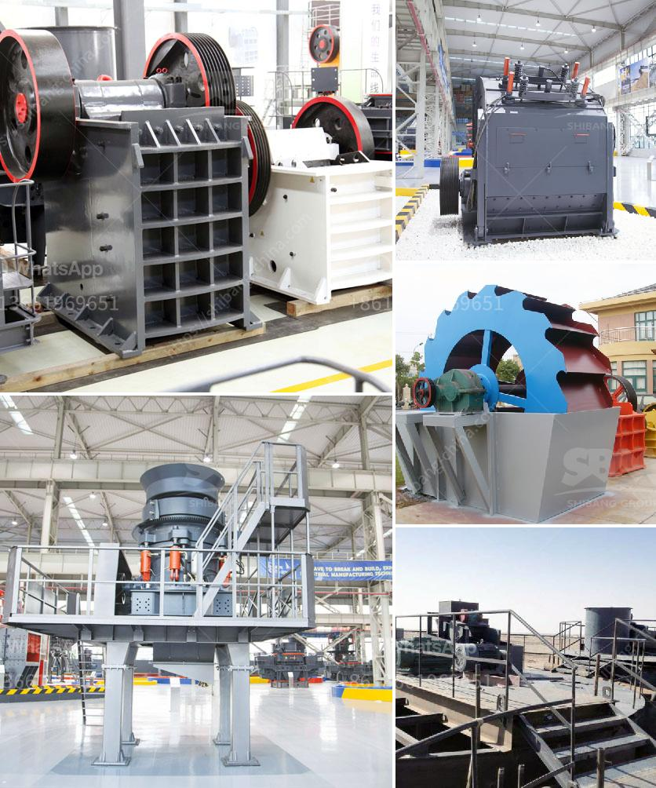

<h3>crushers and wash plant processes</h3>
Crushing and washing plants are essential for the mining and construction industry. These plants are used to break down and clean raw materials such as rocks, ores, and aggregates, enabling them to be transformed into usable products. In this article, we will explore the processes involved in crushers and wash plants and their significance in various industries.

Firstly, let's discuss crushers. Crushers are mechanical machines that apply pressure to break down larger rocks into smaller, more manageable sizes. They are widely used in the mining and construction industry to produce materials for infrastructure projects, such as roads, bridges, and buildings. Crushers work by applying force to the material, crushing it between two solid surfaces.

There are several types of crushers, each designed to handle different types of rocks and materials. For example, jaw crushers are commonly used for primary crushing, where large rocks are initially broken down into smaller sizes. Cone crushers, on the other hand, are used for secondary and tertiary crushing processes, where smaller-sized rocks are further reduced.

After the crushing process, materials typically require further purification and cleaning. This is where the wash plant comes into play. A wash plant is a facility that uses water and mechanical techniques to remove dirt, impurities, and unwanted materials from the crushed rocks or ores. It ensures that the final product meets the required specifications and can be used for various applications.

Wash plants can vary in size and complexity depending on the volume and type of material being processed. They typically consist of different stages and processes, such as screening, scrubbing, and dewatering. Screening involves separating the crushed materials into different-sized fractions using vibrating screens. This helps to ensure uniformity in the final product.

The scrubbing process in a wash plant involves agitating the crushed materials in water to remove any remaining impurities. This is particularly useful for removing clay, silt, and other contaminants that may hinder the quality of the final product. Scrubbing can be achieved through various methods, including rotary trommels and log washers.

Dewatering is the final stage in the wash plant process, where excess moisture is removed from the washed materials. This is critical in ensuring that the products are ready for further processing, transportation, or sale. Dewatering can be done using dewatering screens or filter presses, which squeeze out the water, leaving behind a dried and clean product.

In conclusion, crushers and wash plants play a crucial role in the mining and construction industry by breaking down raw materials and purifying them for various applications. Crushers reduce large rocks into smaller sizes, while wash plants clean and remove impurities from crushed materials. These processes are essential for producing high-quality products used in infrastructure projects. By adopting the appropriate crusher and wash plant techniques, industries can optimize their operations and achieve efficient and cost-effective production.
<h3>Contact us</h3><ul><li><strong>Whatsapp:&nbsp;<a href="https://wa.me/8613661969651">+8613661969651</a></strong></li><li><a href="https://swt.shibang-china.com/?git&amp;zhl&amp;crushers and wash plant processes"><strong>Online Service(chat now)</strong></a></li></ul><h3>Related</h3><ul><li><a href='concrete crushers for recycling.md'>concrete crushers for recycling</a></li><li><a href='charano gold mining ghana.md'>charano gold mining ghana</a></li><li><a href='iron processing equipment in mexico.md'>iron processing equipment in mexico</a></li><li><a href='small stone crushers ontario canada.md'>small stone crushers ontario canada</a></li><li><a href='primary stone crusher.md'>primary stone crusher</a></li></ul>