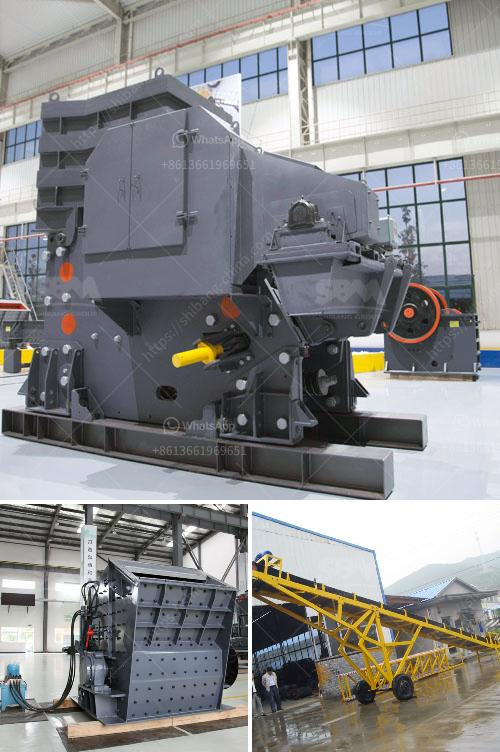

<h3>crushers for recycling machine uae</h3>
In recent years, the world has witnessed an increasing shift towards sustainable practices and eco-consciousness. Recycling has become one of the cornerstones of this movement, as businesses and individuals strive to reduce waste, conserve resources, and minimize their impact on the environment. The United Arab Emirates (UAE) is no exception, as it embraces sustainability and implements various measures to promote recycling.

One essential component of the recycling process is the use of crushers. These machines play a crucial role in breaking down waste materials into smaller, more manageable sizes, making it easier to transport and recycle. In the UAE, where recycling is gaining traction, crushers for recycling machines have become a vital tool for businesses involved in the recycling industry.

Crushers for recycling machines come in various types and sizes, each designed to serve specific recycling needs. One common type is the jaw crusher, which is capable of breaking down large materials into smaller ones using a pair of jaws. This type of crusher is particularly useful for recycling applications involving construction and demolition waste, concrete, bricks, and other similar materials.

Another popular type is the impact crusher, which utilizes impact force to crush materials. It is commonly used in the recycling of asphalt, glass, and other brittle materials. Impact crushers are known for their high reduction ratios, enabling efficient processing of large volumes of waste materials.

The cone crusher is yet another type of crusher commonly used in recycling operations. It is primarily used for crushing asphalt and concrete rubble, producing aggregates that can be reused in construction projects. Cone crushers offer the advantages of high crushing efficiency, low energy consumption, and good shape retention of crushed materials.

Crushers for recycling machines in the UAE are equipped with advanced features and technologies, ensuring optimal performance and minimal environmental impact. Many crushers are mobile, allowing flexibility in their usage and enabling recycling businesses to take them directly to the location of waste materials, further reducing transportation costs and emissions.

Moreover, crushers for recycling machines in the UAE are often equipped with dust suppression systems, minimizing the release of harmful particles into the air during the crushing process. This feature ensures a safer and healthier working environment for operators and nearby communities.

Recycling businesses in the UAE can greatly benefit from the utilization of crushers for recycling machines. Apart from contributing to environmental preservation, these machines offer financial advantages as well. By reducing waste volume and breaking down materials efficiently, crushers help recycling businesses optimize their operations, increase productivity, and reduce waste disposal costs.

Furthermore, the use of crushers enables recycling businesses to produce high-quality recycled materials. Crushed aggregates can be used in various construction applications, promoting a circular economy and reducing the demand for natural resources. This benefits not only the environment but also the construction sector, which can save costs and reduce its ecological footprint.

In conclusion, crushers for recycling machines play a crucial role in the UAE's recycling industry. These machines facilitate the efficient processing of waste materials, reduce transportation costs, and promote the production of high-quality recycled materials. By incorporating crushers into their operations, recycling businesses in the UAE can align themselves with the global sustainability movement and contribute to a greener future for the country.
<h3>Contact us</h3><ul><li><strong>Whatsapp:&nbsp;<a href="https://wa.me/8613661969651">+8613661969651</a></strong></li><li><a href="https://swt.shibang-china.com/?git&amp;zhl&amp;crushers for recycling machine uae"><strong>Online Service(chat now)</strong></a></li></ul><h3>Related</h3><ul><li><a href='product of crushing plant.md'>product of crushing plant</a></li><li><a href='mobile crusher prices in philippines.md'>mobile crusher prices in philippines</a></li><li><a href='raymond mills mexico.md'>raymond mills mexico</a></li><li><a href='greatwall jaw crusher.md'>greatwall jaw crusher</a></li><li><a href='crusher price in philippines.md'>crusher price in philippines</a></li></ul>