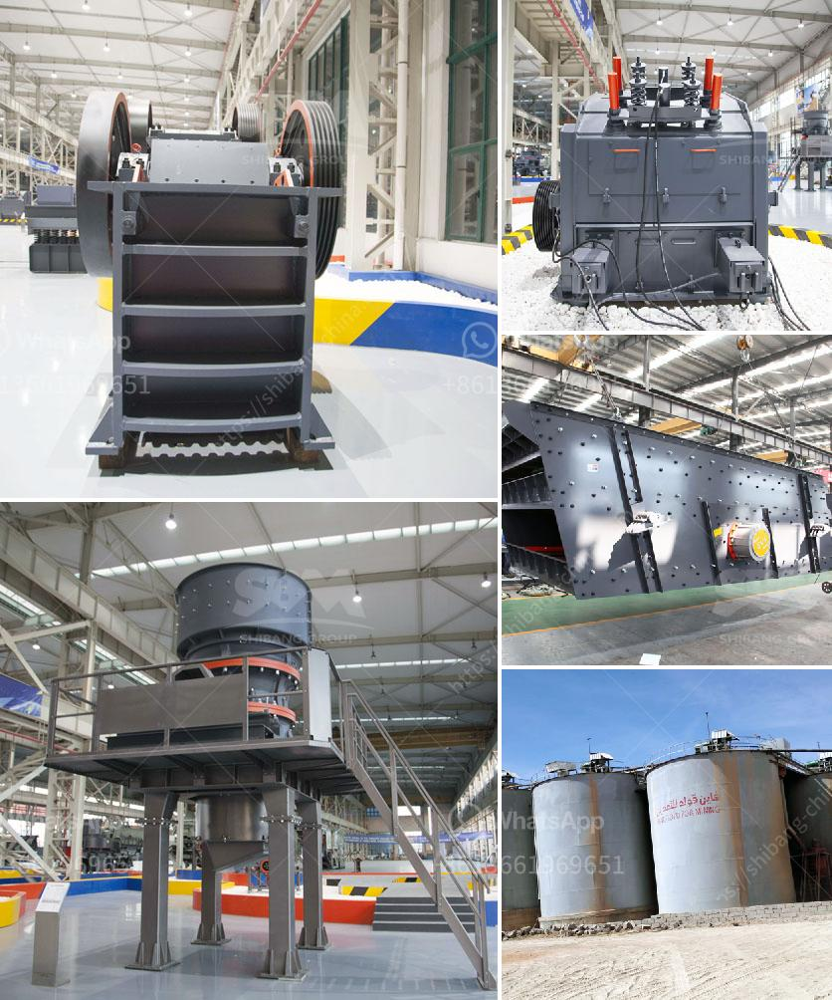

<h3>crushers in malaysia</h3>
Malaysia, a Southeast Asian country known for its modern infrastructure and vibrant economy, relies on construction projects to meet the demands of its growing population. These projects require heavy machinery and equipment, including crushers, which play a vital role in the construction industry. Crushers in Malaysia are crucial components that enhance the efficiency and effectiveness of construction projects, enabling developers to meet deadlines while maintaining high-quality standards.

Crushers are machines designed to break larger rocks, minerals, or stones into smaller pieces, facilitating the processing of materials for various construction purposes. They are commonly used in mining, metallurgy, building materials, and other industries where the size and composition of materials need to be altered for specific applications. In Malaysia, crushers are widely used in construction projects such as highways, bridges, buildings, and even residential homes.

One of the most common types of crushers in Malaysia is the cone crusher. It is an efficient and reliable machine that is capable of breaking rocks into smaller pieces. This type of crusher is widely used in mining, metallurgy, building materials, chemicals, and other industries, making it an essential tool for construction projects.

Another widely used type of crusher in Malaysia is the jaw crusher. This crusher is known for its ability to crush hard and abrasive materials, making it suitable for construction projects that involve crushing rocks, minerals, ores, and stones. Jaw crushers are highly efficient machines that provide quality output and are well-suited for heavy-duty applications.

Malaysia's construction industry often requires crushers that can handle large volumes of material. For such projects, impact crushers are commonly used. These crushers are designed to break down materials through significant impact forces, resulting in the creation of smaller particles. Impact crushers are useful in the construction industry due to their ability to process a wide range of materials quickly and efficiently.

Besides these main types, Malaysia also utilizes other crusher varieties, such as mobile crushers and cone crushers. Mobile crushers are highly versatile and suitable for construction projects that require mobility, allowing for on-site crushing and processing of materials. On the other hand, cone crushers are used for specialized applications where precise shaping of the final product is necessary.

In Malaysia, crushers are not only used in construction projects but also play a significant role in the country's mining industry. Malaysia is known for its abundant resources of minerals, including tin, bauxite, iron ore, and gold. Crushers are essential in extracting and processing these valuable minerals while maintaining environmental sustainability.

The demand for crushers in Malaysia is expected to increase in the coming years as the government continues to focus on infrastructure development. Moreover, with the growth of the housing sector and commercial projects, the need for crushers will only soar higher. To keep up with this demand, Malaysian manufacturers are constantly innovating and improving their crusher designs to ensure maximum efficiency, durability, and environmental friendliness.

In conclusion, crushers are indispensable machinery that fuels construction projects in Malaysia. Whether it's a cone crusher, jaw crusher, impact crusher, or other types, these machines provide the crucial processing capabilities required by the construction and mining industries. As Malaysia continues its development journey, crushers will continue to be a vital force in the country's push for modernization and economic growth.
<h3>Contact us</h3><ul><li><strong>Whatsapp:&nbsp;<a href="https://wa.me/8613661969651">+8613661969651</a></strong></li><li><a href="https://swt.shibang-china.com/?git&amp;zhl&amp;crushers in malaysia"><strong>Online Service(chat now)</strong></a></li></ul><h3>Related</h3><ul><li><a href='raymond grinding mill for sale in thailand.md'>raymond grinding mill for sale in thailand</a></li><li><a href='ball mill pulverizer.md'>ball mill pulverizer</a></li><li><a href='price of portable stonecrusher.md'>price of portable stonecrusher</a></li><li><a href='ballast crusher line.md'>ballast crusher line</a></li><li><a href='gold hammer mills for sale south africa.md'>gold hammer mills for sale south africa</a></li></ul>