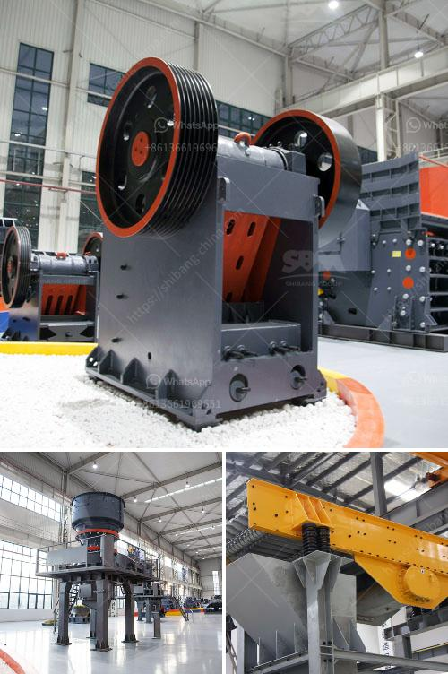

<h3>crushers in saudi arabia</h3>
Saudi Arabia is known for its vast reserves of oil and gas, serving as a key player in the global energy market. As the largest country in the Middle East, Saudi Arabia possesses enormous natural resources and mineral deposits. With such resources, the Kingdom has witnessed rapid industrialization and urbanization over the past few decades. To support these developments, the use of crushers has become a necessary and vital part of Saudi Arabia's construction and mining industries.

Crushers, sometimes referred to as rock crushers, are machines used to break large rocks into smaller rocks, gravel, or rock dust. These machines are commonly used in quarries, mining, construction, demolition, and recycling operations. Crushers come in various types and designs, including jaw crushers, impact crushers, cone crushers, and horizontal crushers, all of which have different applications and benefits.

In Saudi Arabia, crushers are widely used in several industries such as mining, construction, recycling, and demolition. Primarily, crushers enable ore and raw materials to be processed for further use. For example, crushers help in reducing the size of ore extracted from a mine until it can be processed correctly for valuable minerals extraction. Crushing machines also play a significant role in the production of aggregates used in construction projects, encompassing everything from roads to buildings.

Crushers are especially critical in Saudi Arabia's construction boom. The Kingdom's Vision 2030 initiative aims to diversify its economy, reduce its dependence on oil, and promote infrastructure development. Construction projects such as NEOM, Qiddiya, and Riyadh Metro are massive undertakings that require substantial amounts of aggregates and raw materials, all of which are processed using crushers. Without the presence of crushers, Saudi Arabia's construction industry would struggle to keep up with the country's ambitious development plans.

Moreover, crushers are crucial for the recycling and demolition sectors in Saudi Arabia. With the increasing focus on sustainability and environmental protection, recycling has become an essential part of waste management practices. Crushers play a pivotal role in breaking down recycled materials such as concrete, asphalt, and bricks into reusable aggregates. These recycled aggregates can then be used in new construction projects, reducing the need for raw materials extraction and minimizing waste.

In Saudi Arabia, crushers are particularly useful in demolishing old structures and repurposing the materials salvaged from these demolition projects. Rather than disposing of demolished materials in landfills, crushers can crush and process them into reusable materials, contributing to a circular economy approach.

Overall, crushers are a vital asset in Saudi Arabia's construction and mining industry. They facilitate the extraction, processing, and recycling of essential materials needed for infrastructural development and resource sustainability. In addition to enabling economic growth, crushers also contribute to environmental preservation by reducing the demand for new raw materials and promoting efficient waste management.

As the Kingdom continues to pursue its ambitious Vision 2030 goals, the demand for crushers is expected to grow further. The Saudi Arabian government and private sector should work together to invest in this essential sector, ensuring its development and expansion. By doing so, Saudi Arabia can continue to thrive economically, technologically, and environmentally.
<h3>Contact us</h3><ul><li><strong>Whatsapp:&nbsp;<a href="https://wa.me/8613661969651">+8613661969651</a></strong></li><li><a href="https://swt.shibang-china.com/?git&amp;zhl&amp;crushers in saudi arabia"><strong>Online Service(chat now)</strong></a></li></ul><h3>Related</h3><ul><li><a href='conveyor belt distributor in nigeria.md'>conveyor belt distributor in nigeria</a></li><li><a href='dolomite crushing machine pdf.md'>dolomite crushing machine pdf</a></li><li><a href='functions conical crusher.md'>functions conical crusher</a></li><li><a href='quarry screening equipment.md'>quarry screening equipment</a></li><li><a href='raymond mills mexico.md'>raymond mills mexico</a></li></ul>