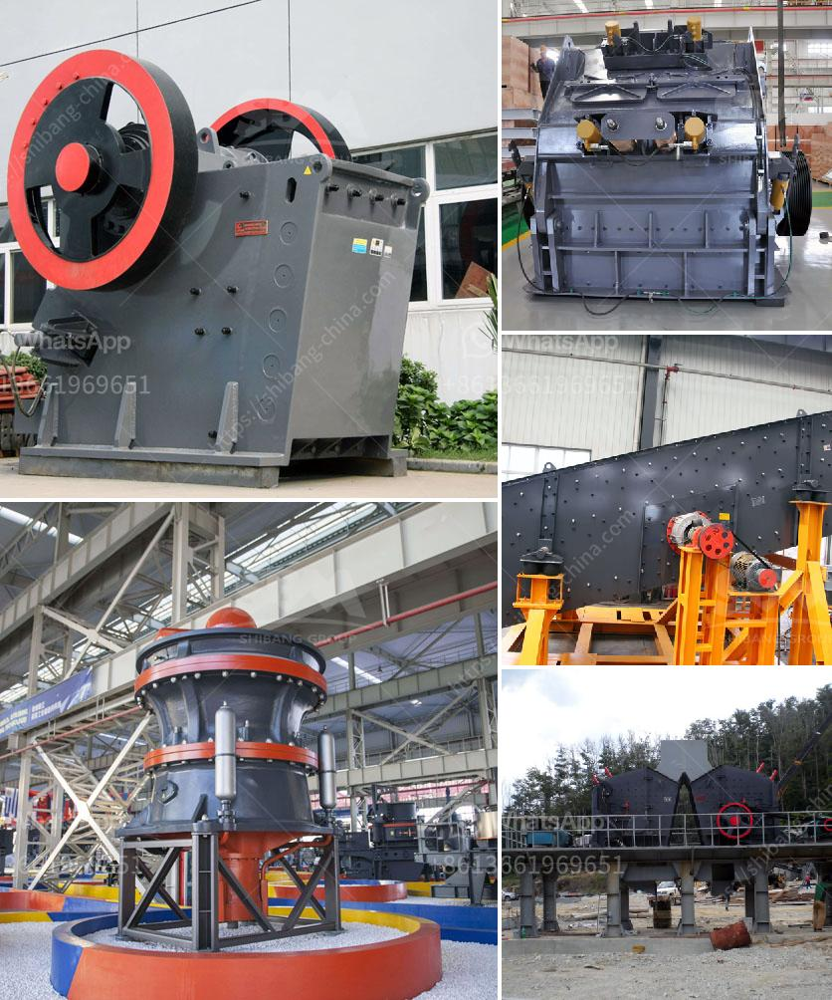

<h3>crushers made in south korea</h3>
South Korea, known for its exceptional engineering prowess and technological advancements, has become a global leader in various industries. One such sector where the country showcases its expertise is the manufacturing of high-quality crushers.

South Korean crushers have gained significant recognition worldwide due to their exceptional performance, durability, and innovative features. These crushers are designed to efficiently break down different materials and are widely used in mining, construction, and recycling industries.

One of the key factors driving the success of crushers made in South Korea is the commitment to research and development. Korean manufacturers continually invest in cutting-edge technologies to improve the efficiency and productivity of their crushers. This relentless pursuit of innovation has allowed them to introduce advanced features such as remote control operation, automated settings, and intelligent systems that optimize performance based on different materials and crushing requirements.

Moreover, South Korean crushers are built with precision engineering and attention to detail, ensuring that they withstand heavy-duty operations and challenging environmental conditions. These crushers are known for their robust construction, high-quality components, and efficient power delivery, guaranteeing a reliable and long-lasting performance.

Another noteworthy aspect of South Korean crushers is their versatility. Manufacturers offer a wide range of crusher models tailored to various applications, enabling customers to choose the most suitable equipment for their specific needs. Whether it's crushing hard rock, processing aggregates, or recycling materials, there is a South Korean crusher model designed to deliver exceptional results.

Furthermore, South Korean manufacturers have established a strong global presence, setting up distribution networks to cater to international markets. Their focus on customer satisfaction and after-sales service ensures that customers receive comprehensive support, including spare parts availability and technical assistance.

In conclusion, crushers made in South Korea exemplify the country's reputation for excellence and innovation. These crushers deliver exceptional performance, durability, and versatility, making them a preferred choice for various industries globally. As South Korean manufacturers continue to invest in research and development, the future looks promising for the constant improvement and evolution of crushers, solidifying South Korea's position as a leading player in the global crusher manufacturing industry.
<h3>Contact us</h3><ul><li><strong>Whatsapp:&nbsp;<a href="https://wa.me/8613661969651">+8613661969651</a></strong></li><li><a href="https://swt.shibang-china.com/?git&amp;zhl&amp;crushers made in south korea"><strong>Online Service(chat now)</strong></a></li></ul><h3>Related</h3><ul><li><a href='puzzolana crusher tonnes per hour.md'>puzzolana crusher tonnes per hour</a></li><li><a href='gold hammer mills in harare zimbabwe.md'>gold hammer mills in harare zimbabwe</a></li><li><a href='controlling parameter of impact crusher.md'>controlling parameter of impact crusher</a></li><li><a href='crusher machine manufacturer in coimbatore.md'>crusher machine manufacturer in coimbatore</a></li><li><a href='calcium carbonate powder machine.md'>calcium carbonate powder machine</a></li></ul>