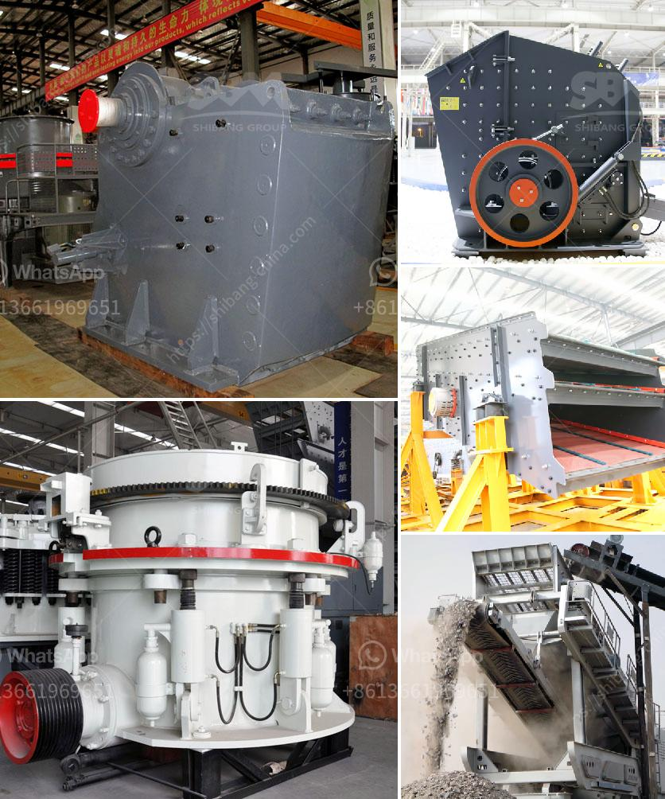

<h3>crushers manufacturer turkey</h3>
Crushers play a vital role in the production of aggregates and other construction materials. They are essential equipment in the mining and quarrying industry, crushing big rocks into smaller, more manageable pieces. As with any machinery, choosing the right crusher manufacturer is crucial for optimal performance and longevity.

Turkey has emerged as a prominent player in the crushers manufacturing industry, providing high-quality machines to countless clients around the world. Turkish crusher manufacturers have been building reliable and technologically advanced machines that meet international standards.

One such company that exemplifies Turkey's prowess in this field is Türkiye Ä°ÅŸ Makinaları, an innovative manufacturer of crushing and screening equipment. With over 20 years of experience, the company has grown to become a leading supplier of crushers in Turkey and beyond.

Türkiye Ä°ÅŸ Makinaları manufactures a wide range of crushers, including jaw crushers, impact crushers, cone crushers, and high-speed crushers. They also offer a variety of screening equipment and conveyor systems to complement their crushers.

What sets Türkiye Ä°ÅŸ Makinaları apart from its competitors is its commitment to quality. All their machines go through rigorous testing to ensure they meet the highest industry standards. Additionally, the company uses cutting-edge technology and modern manufacturing processes to produce crushers that are efficient, reliable, and environmentally friendly.

Another notable Turkish crusher manufacturer is PTFE Makina. Established in 1978, the company specializes in the production of mobile crushing and screening plants, as well as conveyors, crushers spare parts, and washing equipment. Over the years, PTFE Makina has gained a solid reputation for delivering superior quality products and exceptional customer service.

Importantly, both Türkiye Ä°ÅŸ Makinaları and PTFE Makina prioritize customer satisfaction. They work closely with clients to understand their specific needs and offer customized solutions that align with their requirements. Additionally, both companies provide reliable after-sales support, ensuring that their clients' crushers continue to operate efficiently for years to come.

In conclusion, Turkey has become a reliable and innovative crushers manufacturer, offering high-quality machines that meet international standards. Companies like Türkiye Ä°ÅŸ Makinaları and PTFE Makina have played a significant role in establishing Turkey as a leading player in this industry. As demand for crushers continues to grow, customers can rely on Turkish manufacturers to deliver reliable and efficient machines that enhance their operations.
<h3>Contact us</h3><ul><li><strong>Whatsapp:&nbsp;<a href="https://wa.me/8613661969651">+8613661969651</a></strong></li><li><a href="https://swt.shibang-china.com/?git&amp;zhl&amp;crushers manufacturer turkey"><strong>Online Service(chat now)</strong></a></li></ul><h3>Related</h3><ul><li><a href='harga mesin pemecah batu kapasitas satu ton.md'>harga mesin pemecah batu kapasitas satu ton</a></li><li><a href='coal mill grinding rolls.md'>coal mill grinding rolls</a></li><li><a href='germany rocks crushers.md'>germany rocks crushers</a></li><li><a href='cost of a cement grinding plant in india.md'>cost of a cement grinding plant in india</a></li><li><a href='diesel compressors for sale in south africa.md'>diesel compressors for sale in south africa</a></li></ul>