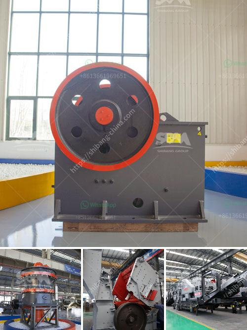

<h3>crushers manufacturers in south africa</h3>
Crushers are industrial machines that are used to crush rocks and reduce their size in various applications. Some of the industries where crushers are used include mining, metallurgy, construction, and others. In recent years, South Africa has witnessed a significant growth in the infrastructure sector, which has led to a rise in the use of crushers in the country. In this article, we will be discussing crushers manufacturers in South Africa.

Based on the type of crusher machine, crushers manufacturers in South Africa can be categorized into several types, including jaw crushers, cone crushers, impact crushers, gyratory crushers, and others.

Jaw crushers are commonly used as primary crushers due to their potential to withstand heavy loads and abrasive materials. These machines have a fixed jaw and a movable jaw, which moves back and forth to crush the rocks. Some of the prominent jaw crusher manufacturers in South Africa include Metso, Sandvik, and Finlay.

Cone crushers are primarily used as secondary crushers and are well-suited for applications where high reduction ratios are required. These machines feature a cone-shaped crushing chamber and an eccentrically rotating mantle. Some of the well-known cone crusher manufacturers in South Africa are Terex, Atlas Copco, and Keestrack.

Impact crushers are machines designed to crush rocks using impact rather than pressure. These machines contain hammers that rotate at high speeds to deliver powerful blows to the material. Some notable manufacturers of impact crushers in South Africa are Pilot Crushtec, Rubble Master, and Metso.

Gyratory crushers are used in the mining industry to break and crush rock material. These machines consist of a concave surface and a conical head, both of which are usually lined with manganese steel. Notable gyratory crusher manufacturers in South Africa include FLSmidth and Mogensen.

In conclusion, crushers manufacturers in South Africa have a wide array of options to suit various needs and budgets. Whether it is a jaw crusher, cone crusher, impact crusher, or gyratory crusher, every potential buyer should take the time to compare several different models from different manufacturers in order to get the best deal.
<h3>Contact us</h3><ul><li><strong>Whatsapp:&nbsp;<a href="https://wa.me/8613661969651">+8613661969651</a></strong></li><li><a href="https://swt.shibang-china.com/?git&amp;zhl&amp;crushers manufacturers in south africa"><strong>Online Service(chat now)</strong></a></li></ul><h3>Related</h3><ul><li><a href='simple diagram for high energy ball milling.md'>simple diagram for high energy ball milling</a></li><li><a href='feasibility study for the establishment of quarry.md'>feasibility study for the establishment of quarry</a></li><li><a href='ball mill working in hindi.md'>ball mill working in hindi</a></li><li><a href='gemstone mining and processing machine.md'>gemstone mining and processing machine</a></li><li><a href='rubber mill grinder.md'>rubber mill grinder</a></li></ul>