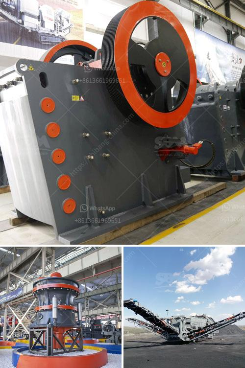

<h3>crushers of crushers</h3>
Crushers are essential pieces of machinery used in various industries, including mining, construction, and recycling. They have different types and sizes to meet diverse crushing needs. In this article, we will explore some of the crushers that are widely used and their applications.

The jaw crusher is one of the most commonly used crushers in the mining and quarrying industry. It is designed to crush large rocks into smaller pieces, commonly used for gravel, concrete, and construction aggregates. The primary function of a jaw crusher is to reduce the size of the materials for further processing.

Cone crushers are frequently used in the secondary and tertiary crushing stages. They are suitable for a wide range of applications, from hard and abrasive rocks to soft and friable materials. Cone crushers operate by squeezing the material between an eccentrically rotating cone and a concave wall. This action creates a pressurized crushing chamber, ensuring efficient reduction of the material.

Impact crushers are versatile machines that can handle a variety of materials and sizes. They are commonly used in quarrying, mining, and recycling applications. Impact crushers rely on impact forces generated by the rotor to crush materials. These forces can be significantly higher than with jaw or cone crushers, resulting in higher reduction ratios.

Hammer crushers are primarily used in the mining industry to crush material with high moisture content and compressive strength. They can handle materials with sizes up to 1 meter and provide a uniform final product. Hammer crushers rely on impact forces produced by hammers rotating at high speeds to crush the material.

Gyratory crushers are mainly used for primary crushing in large-scale mining operations. They have a solid cone-shaped crushing head and a fixed concave surface. The material is fed from the top and crushed as it travels down, eventually exiting through the bottom of the crusher. Gyratory crushers can handle large rocks and are often used in ore processing plants.

Mobile crushers are designed to be moved around the job site, allowing for flexibility and convenience. They are commonly used in construction and demolition projects, as well as in quarries and mines. With mobile crushers, the material can be crushed directly at the site, eliminating the need for transportation to a stationary crusher.

In conclusion, crushers play a vital role in the mining, construction, and recycling industries by breaking down large rocks and materials into smaller, more manageable sizes. Jaw crushers, cone crushers, impact crushers, hammer crushers, gyratory crushers, and mobile crushers are just a few examples of the numerous types of crushers available. Each type has its own unique features and applications, ensuring there is a crusher suitable for every crushing need.
<h3>Contact us</h3><ul><li><strong>Whatsapp:&nbsp;<a href="https://wa.me/8613661969651">+8613661969651</a></strong></li><li><a href="https://swt.shibang-china.com/?git&amp;zhl&amp;crushers of crushers"><strong>Online Service(chat now)</strong></a></li></ul><h3>Related</h3><ul><li><a href='hammer pulverizer machine price.md'>hammer pulverizer machine price</a></li><li><a href='limestone mobile crusher supplier in malaysia.md'>limestone mobile crusher supplier in malaysia</a></li><li><a href='working hours of a crusher plant.md'>working hours of a crusher plant</a></li><li><a href='screen clay from limestone rock.md'>screen clay from limestone rock</a></li><li><a href='slag crushing plant manufacturers in india.md'>slag crushing plant manufacturers in india</a></li></ul>