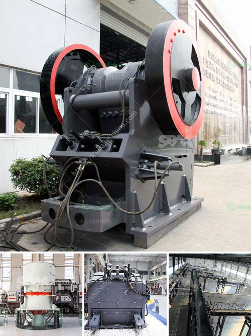

<h3>crushing and grinding equipment cost in ethiopia</h3>
Ethiopia, being one of the developing countries in Africa, has seen an increase in demand for various industrial machineries, including crushing and grinding equipment. Ethiopia has abundant mineral resources and its mining industry is rapidly growing. The country is also experiencing an infrastructure boom, which requires efficient crushing and grinding equipment to produce aggregates and materials for construction projects. However, the cost of such equipment remains a challenge for many businesses in Ethiopia.

The cost of crushing and grinding equipment in Ethiopia is influenced by various factors such as the availability of raw materials, labor costs, supply and demand, and technological advancements. Ethiopia has significant deposits of various minerals, including gold, tantalum, platinum, nickel, potash, and limestone, which are key materials used in the production of crushing and grinding equipment. However, the extraction and processing of these resources require significant investments in infrastructure and mining operations, which can increase the cost of the equipment.

Labor costs also play a crucial role in determining the cost of crushing and grinding equipment in Ethiopia. The country has a large population, and the availability of skilled and affordable labor is essential in reducing production costs. However, the high unemployment rate and the lack of skilled laborers in the mining and construction sectors can result in increased labor costs. This, in turn, affects the overall cost of the equipment and its affordability for businesses in Ethiopia.

Supply and demand dynamics also influence the cost of crushing and grinding equipment in Ethiopia. The demand for such equipment has been increasing as the mining and construction industries grow. However, the supply of these machines is limited, both domestically and internationally. Local manufacturers in Ethiopia are still in the early stages of development and face challenges in terms of capacity and technology. As a result, most businesses rely on imports, which can drive up the cost of the equipment due to import duties, taxes, and transportation costs.

Technological advancements in crushing and grinding equipment can help reduce costs in the long run. Modern machinery is more efficient, has higher productivity, requires less maintenance, and consumes less energy. However, the initial cost of acquiring advanced equipment might be higher, which poses a challenge for businesses in Ethiopia. Additionally, the lack of access to financing options and the high interest rates can make it difficult for businesses to invest in modern machinery.

In conclusion, the cost of crushing and grinding equipment in Ethiopia is influenced by various factors, including the availability of raw materials, labor costs, supply and demand dynamics, and technological advancements. While Ethiopia has abundant mineral resources, the extraction and processing of these resources require significant investments. Labor costs, supply and demand dynamics, and limited access to modern machinery and financing options also contribute to the overall cost of the equipment. Overcoming these challenges is crucial to ensure the affordability and availability of crushing and grinding equipment for businesses in Ethiopia, contributing to the growth and development of the mining and construction industries.
<h3>Contact us</h3><ul><li><strong>Whatsapp:&nbsp;<a href="https://wa.me/8613661969651">+8613661969651</a></strong></li><li><a href="https://swt.shibang-china.com/?git&amp;zhl&amp;crushing and grinding equipment cost in ethiopia"><strong>Online Service(chat now)</strong></a></li></ul><h3>Related</h3><ul><li><a href='jaw stone crusher in turkey.md'>jaw stone crusher in turkey</a></li><li><a href='chromite ore crusher in pakistan.md'>chromite ore crusher in pakistan</a></li><li><a href='gold ore processing nigeria.md'>gold ore processing nigeria</a></li><li><a href='cement plant for sale in india 200 tpd.md'>cement plant for sale in india 200 tpd</a></li><li><a href='hammer mill for cerelaes.md'>hammer mill for cerelaes</a></li></ul>