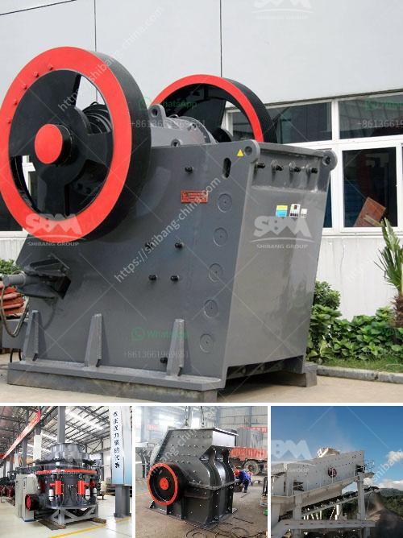

<h3>crushing and screening process</h3>
The crushing and screening process is an essential part of the quarrying and mining industry, allowing businesses to separate valuable minerals from waste material, as well as preparing aggregates for various applications. In this article, we will explore the crushing and screening process in depth and discuss the latest developments and advancements in this field.

The crushing process is primarily employed for the size reduction of large-sized rocks or materials into smaller, more manageable particles. Crushers are machines designed to break these larger rocks into smaller rocks, gravel, or rock dust. There are various types of crushers available in the market, including jaw crushers, cone crushers, impact crushers, and gyratory crushers. Each type of crusher has its unique characteristics and is employed for specific applications.

Once the rocks or materials have been crushed, they undergo further processing through the screening process. The screening process is used to separate different sizes of crushed materials or aggregates, ensuring that the final product is of the desired size. This is achieved by passing the crushed material through a series of screens with different-sized openings. The screens allow smaller particles to pass through while retaining larger particles.

In recent years, advancements in technology have revolutionized the crushing and screening process, making it more efficient and cost-effective. One such development is the use of mobile crushing and screening plants. These portable plants can be easily transported to various locations, allowing businesses to crush and screen materials on-site, eliminating the need for costly transportation.

Additionally, automation and remote-controlled systems have improved the overall efficiency and safety of the crushing and screening process. Advanced control systems enable operators to monitor and adjust the process remotely, minimizing the risk of accidents and increasing productivity. Furthermore, predictive maintenance systems can detect potential equipment failures, allowing for timely repairs and reducing downtime.

It is worth mentioning that the crushing and screening process plays a crucial role in sustainable development and environmental protection. Efforts have been made to reduce the environmental impact of this process by implementing dust suppression systems and recycling technologies. Dust suppression systems help control airborne dust generated during crushing and screening operations, protecting the environment and improving working conditions.

In conclusion, the crushing and screening process is essential for the quarrying and mining industry. It enables the separation of valuable minerals from waste material and prepares aggregates for various applications. Advancements in technology, such as mobile plants and automation, have increased efficiency and productivity while reducing costs. Moreover, efforts to minimize the environmental impact of this process have been made through the implementation of dust suppression systems and recycling technologies. The crushing and screening process will continue to evolve, driven by technological advancements and the need for sustainable practices in the industry.
<h3>Contact us</h3><ul><li><strong>Whatsapp:&nbsp;<a href="https://wa.me/8613661969651">+8613661969651</a></strong></li><li><a href="https://swt.shibang-china.com/?git&amp;zhl&amp;crushing and screening process"><strong>Online Service(chat now)</strong></a></li></ul><h3>Related</h3><ul><li><a href='tones per hour in limestone prduction.md'>tones per hour in limestone prduction</a></li><li><a href='automation coal crushing and conveyor.md'>automation coal crushing and conveyor</a></li><li><a href='crusher and producton per hour.md'>crusher and producton per hour</a></li><li><a href='stone crushers price in south.md'>stone crushers price in south</a></li><li><a href='300 tph jaw crusher.md'>300 tph jaw crusher</a></li></ul>