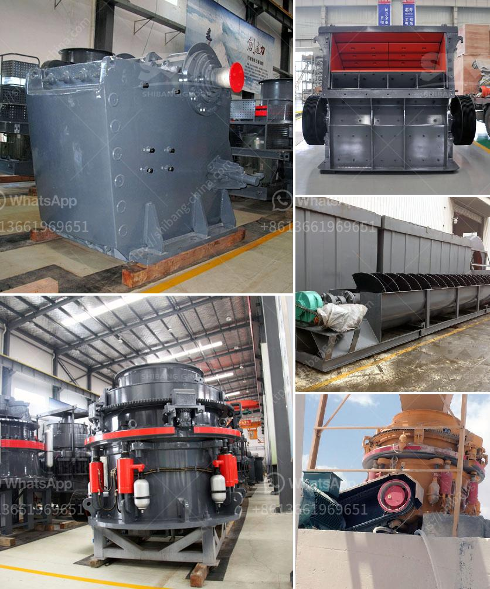

<h3>crushing companies in the usa</h3>
In recent years, the United States has witnessed a notable surge in crushing companies, businesses specializing in the mechanical fragmentation of materials such as concrete, asphalt, and rock. These companies play a crucial role in the construction and demolition industries and have seen increased demand due to rising urbanization and the need for infrastructure development. However, as their numbers grow, they also face challenges and concerns that need addressing for sustainable growth.

Crushing companies are instrumental in the process of turning construction and demolition waste into valuable resources. They use specialized equipment such as crushers, screens, and conveyors to mechanically break down larger materials into smaller fragments, which can be reused for new construction projects. By reducing waste and minimizing the need for extraction of new resources, crushing companies contribute to sustainable practices in the industry.

The growth of crushing companies in the USA has had a positive impact on both the economy and the environment. Economically, these companies create employment opportunities, both directly and indirectly, in various sectors of the industry. Additionally, their services help save costs in waste disposal for construction companies and local governments.

From an environmental standpoint, crushing companies significantly reduce the amount of construction and demolition waste that ends up in landfills. By recycling and reusing materials, they help conserve natural resources and reduce carbon emissions associated with traditional disposal methods. This contributes to the overall sustainability goals of the country.

While crushing companies play a crucial role, they also face several challenges that need addressing. One primary challenge is the necessary permits and licenses required to operate legally. Obtaining the necessary approvals can be a time-consuming and costly process, which may hinder the establishment and expansion of crushing companies.

Another challenge is the lack of awareness and understanding among key stakeholders about the benefits of utilizing crushing services. Construction companies and developers may not be fully aware of how crushing can help them save costs and improve sustainability. There is a need for increased education and outreach efforts to foster collaborations and encourage the adoption of crushing practices.

Furthermore, crushing companies must ensure they adhere to strict regulations and standards regarding dust control, noise pollution, and environmental impact. As they operate in both residential and commercial areas, concerns about air quality, noise disturbances, and potential environmental hazards arise. Investing in technologies and best practices to mitigate these concerns is crucial for long-term success.

The proliferation of crushing companies in the USA has been driven by the increasing demand for sustainable practices in the construction and demolition industries. While they bring economic benefits and contribute to environmental conservation, they also face challenges relating to regulations, awareness, and environmental impact. By addressing these challenges collaboratively, crushing companies can continue to play a vital role in redefining the construction industry's sustainability standards for a greener future.
<h3>Contact us</h3><ul><li><strong>Whatsapp:&nbsp;<a href="https://wa.me/8613661969651">+8613661969651</a></strong></li><li><a href="https://swt.shibang-china.com/?git&amp;zhl&amp;crushing companies in the usa"><strong>Online Service(chat now)</strong></a></li></ul><h3>Related</h3><ul><li><a href='stone crusher machine sale in zambia.md'>stone crusher machine sale in zambia</a></li><li><a href='floating processing mining plants.md'>floating processing mining plants</a></li><li><a href='cement factory sale in tamilnadu.md'>cement factory sale in tamilnadu</a></li><li><a href='crusher machine for sale tanzania.md'>crusher machine for sale tanzania</a></li><li><a href='mobile stone crusher in saudi.md'>mobile stone crusher in saudi</a></li></ul>