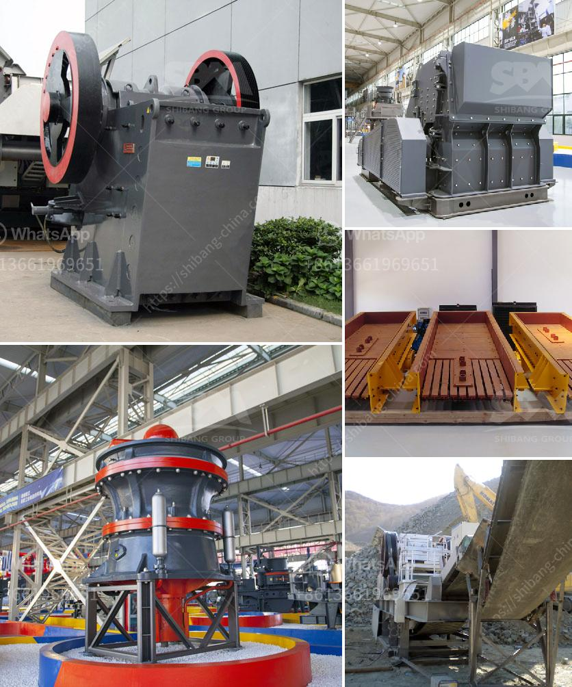

<h3>crushing equipment from</h3>
In the world of mining and quarrying, numerous forms of equipment are used to extract and process minerals and raw materials. Amongst them, crushing equipment plays a vital role in transforming large-sized rocks and stones into smaller particles, making them suitable for use in various industrial applications. The advancement in technology has led to the development of highly efficient crushing equipment that ensures productivity, operational reliability, and cost-effectiveness.

One of the most common types of crushing equipment is the jaw crusher. It is designed to handle various types of materials, including granite, limestone, iron ore, and concrete. The jaw crusher uses compressive force to crush these materials, exerting immense pressure and reducing them to smaller sizes. With its simple structure and reliable operation, the jaw crusher is widely used in mining, construction, and demolition sites.

Cone crushers are another type of crushing equipment widely used in the mining industry. They are suitable for medium to hard materials and are commonly used for secondary or tertiary crushing. The cone crusher operates by compressing the material between an eccentrically gyrating spindle and a concave hopper. This action breaks the material down into even smaller pieces, providing consistent and uniform particle size distribution.

Impact crushers are popular crushing equipment used in the construction and recycling industries. They utilize impact force to crush the material, generating high-speed collisions between the rotor and the feed material. Impact crushers are capable of producing high-quality and uniform aggregates for road construction and concrete production.

When it comes to crushing equipment, efficiency and productivity are key considerations. Manufacturers are continually developing more advanced technology to enhance the performance of crushing equipment. For instance, many modern crushers are equipped with automated systems that monitor the load, speed, and settings, ensuring optimal performance and preventing damage from overload.

Crushing equipment is designed to withstand heavy-duty operations and harsh environments. Robust construction and high-quality materials enable it to endure the demanding conditions of mining and quarrying activities. Furthermore, crushers are often equipped with advanced safety features, such as emergency stop buttons, protective guards, and sensors, to ensure the safety of operators and maintenance personnel.

In addition to crushing rocks and stones, crushing equipment can also handle other materials like concrete, asphalt, and bricks. This versatility makes it a valuable asset in the construction and demolition industries. Instead of disposing of these materials, they can be crushed and recycled, saving costs and reducing environmental impact.

As the demand for aggregates and processed materials continues to grow, the need for efficient crushing equipment becomes even more crucial. Efficient crushers not only improve productivity but also reduce operational costs and minimize downtime. With the constant advancements in technology, the crushing equipment market is expected to witness further innovation and development.

In conclusion, crushing equipment plays a pivotal role in the mining, quarrying, and construction industries. Whether it's a jaw crusher, cone crusher, or impact crusher, these machines transform large-sized rocks and stones into smaller particles, making them suitable for various applications. The continuous advancement in technology ensures that crushing equipment is becoming more efficient, reliable, and safe. As the demand for processed materials increases, manufacturers are striving to develop superior crushing equipment to meet the industry's requirements.
<h3>Contact us</h3><ul><li><strong>Whatsapp:&nbsp;<a href="https://wa.me/8613661969651">+8613661969651</a></strong></li><li><a href="https://swt.shibang-china.com/?git&amp;zhl&amp;crushing equipment from"><strong>Online Service(chat now)</strong></a></li></ul><h3>Related</h3><ul><li><a href='slag crusher makers in india.md'>slag crusher makers in india</a></li><li><a href='industrial mills for coal.md'>industrial mills for coal</a></li><li><a href='vertical impact crusher manufacturer in india.md'>vertical impact crusher manufacturer in india</a></li><li><a href='stone crusher machine dealer in uae.md'>stone crusher machine dealer in uae</a></li><li><a href='crushing equipment from.md'>crushing equipment from</a></li></ul>