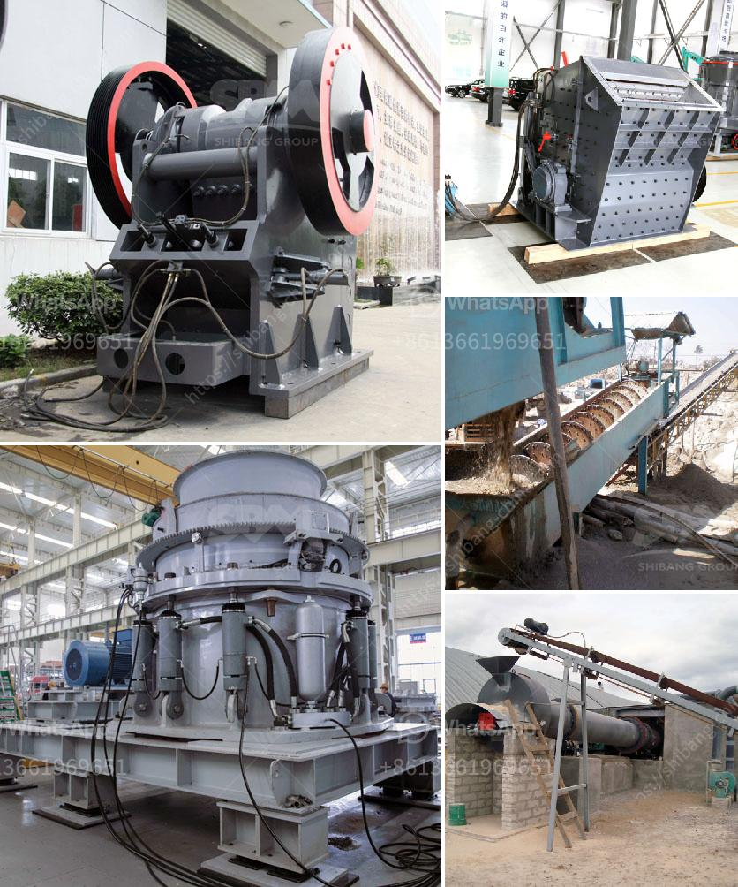

<h3>crushing machine company</h3>
With the advancement in technology and increasing demand for efficient machinery in various industries, the role of crushing machine companies has become paramount. These companies provide cutting-edge equipment that significantly simplifies and enhances the crushing process for materials, helping businesses overcome productivity challenges. This article delves into the operations and importance of crushing machine companies, highlighting their contributions to industrial progress.

Industries such as mining, construction, recycling, and manufacturing require efficient methods to extract, crush, and process raw materials effectively. These companies revolutionize these sectors by providing innovative machines that can crush stones, minerals, rocks, and other materials to desired specifications. As a result, the industries can extract valuable resources, produce essential building materials, and facilitate recycling initiatives.

Crushing machine companies specialize in manufacturing robust machinery designed to crush materials of various sizes and hardness levels. They offer a wide range of crushing equipment, including cone crushers, jaw crushers, impact crushers, and even portable plants that can be customized to meet specific industrial requirements.

The key strength of crushing machine companies lies in their ability to innovate and customize equipment. Each industry has unique demands, and these companies understand the importance of tailoring solutions to match them. Cutting-edge technologies, such as automation, remote controls, and intelligent systems, have further revolutionized the way the machines operate. With precise engineering and technological advancements, these companies ensure that the crushing process delivers maximal productivity and efficiency.

Crushing machines, if not operated safely, can pose risks. However, crushing machine companies prioritize safety by incorporating mechanisms such as automated sensor systems, emergency stop buttons, and advanced control units. These features not only safeguard workers but also enhance the overall efficiency and reliability of the machines, reducing downtime and maintenance costs.

Many crushing machine companies have also recognized the need to reduce the environmental impact of their operations. By investing in eco-friendly technologies, such as energy-efficient motors and reduced dust emissions, these companies contribute to sustainable development. Additionally, they prioritize recycling and waste management, making the crushing process more environmentally responsible.

Continual advancements in the crushing machine industry are driven by customer feedback, market demands, and technological developments. As a result, companies provide regular updates and improvements to their products, ensuring that customers always have access to the latest cutting-edge machinery.

The crushing machine industry has played a vital role in transforming various sectors by providing efficient, custom-made solutions for the crushing process. By continually innovating and incorporating advanced technologies, these companies enable industries to maximize productivity, improve safety, and minimize environmental impacts. As industries continue to evolve, the importance of crushing machine companies will remain significant, serving as catalysts for progress and revolutionizing industrial processes.
<h3>Contact us</h3><ul><li><strong>Whatsapp:&nbsp;<a href="https://wa.me/8613661969651">+8613661969651</a></strong></li><li><a href="https://swt.shibang-china.com/?git&amp;zhl&amp;crushing machine company"><strong>Online Service(chat now)</strong></a></li></ul><h3>Related</h3><ul><li><a href='talc powder mill suppliers in china.md'>talc powder mill suppliers in china</a></li><li><a href='mobile crusher tph.md'>mobile crusher tph</a></li><li><a href='stone crusher sale in peru.md'>stone crusher sale in peru</a></li><li><a href='jaw crushers for sale in uganda.md'>jaw crushers for sale in uganda</a></li><li><a href='barite mining process.md'>barite mining process</a></li></ul>