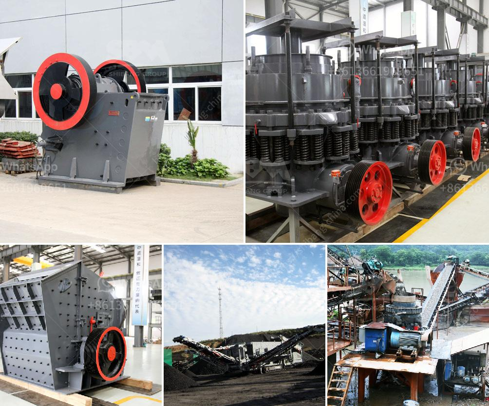

<h3>crushing machine manufacturer in maharashtra</h3>
Crushing machines play a significant role in the manufacturing and construction industries. These machines can break down large rocks, minerals, and other materials into smaller pieces, making them easier to handle and transport. In the state of Maharashtra, there are several reputed crushing machine manufacturers, meeting the growing demand for these machines.

One prominent manufacturer in Maharashtra is Shakti Mining Equipment Pvt Ltd. Since its establishment in 1986, the company has been designing and manufacturing a wide range of crushing machines, such as cone crushers, jaw crushers, and vertical shaft impactors. They have gained a strong reputation for delivering high-quality and reliable machines to their customers.

Shakti Mining Equipment Pvt Ltd emphasizes innovation and technology in their manufacturing process. They constantly strive to incorporate the latest advancements in crushing machine technology to provide efficient and cost-effective solutions. This commitment to innovation has helped them maintain their position as a leading crushing machine manufacturer in Maharashtra.

Another renowned manufacturer in Maharashtra is R.D. Mining Equipments Pvt Ltd. With over three decades of experience, the company has become a trusted name in the industry. They specialize in manufacturing various types of crushing machines, including jaw crushers, cone crushers, horizontal shaft impactors, and vibrating screens.

R.D. Mining Equipments Pvt Ltd focuses on delivering machines that are durable, low-maintenance, and user-friendly. They understand the importance of providing reliable equipment, as any downtime can result in significant losses for their customers. Hence, they pay utmost attention to the quality and performance of their crushing machines, ensuring they meet the highest industry standards.

In addition to these established manufacturers, there are several emerging crushing machine manufacturers in Maharashtra. These companies are leveraging the state's strong industrial base and skilled workforce to produce high-quality machines. They are also investing in research and development to introduce innovative features and technologies in their machines.

The rise of these crushing machine manufacturers in Maharashtra is contributing to the growth of the state's economy. These companies generate employment opportunities, both directly and indirectly, by partnering with local suppliers and service providers. Furthermore, their machines help improve productivity in various sectors, such as mining, construction, and infrastructure development.

With the increasing demand for crushing machines in Maharashtra, it is essential to choose a reliable and reputable manufacturer. Buyers should consider factors such as the manufacturer's experience, track record, technical expertise, and after-sales support. It is also crucial to evaluate the quality and performance of the machines they offer to ensure they meet the specific requirements of the project.

In conclusion, Maharashtra is home to several leading crushing machine manufacturers that cater to the diverse needs of industries. These manufacturers focus on delivering innovative, durable, and reliable machines to enhance productivity and efficiency in various sectors. With their commitment to technology and customer satisfaction, they play a vital role in Maharashtra's industrial growth and development.
<h3>Contact us</h3><ul><li><strong>Whatsapp:&nbsp;<a href="https://wa.me/8613661969651">+8613661969651</a></strong></li><li><a href="https://swt.shibang-china.com/?git&amp;zhl&amp;crushing machine manufacturer in maharashtra"><strong>Online Service(chat now)</strong></a></li></ul><h3>Related</h3><ul><li><a href='mobile crusher tph.md'>mobile crusher tph</a></li><li><a href='grinding ball mill machine.md'>grinding ball mill machine</a></li><li><a href='list of gold refineries companies in uae.md'>list of gold refineries companies in uae</a></li><li><a href='cone crusher hp 300.md'>cone crusher hp 300</a></li><li><a href='tons stationary impact granite crusher.md'>tons stationary impact granite crusher</a></li></ul>