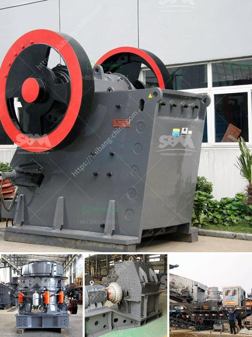

<h3>crushing machine manufacturers</h3>
The mining and construction industry is a huge global sector that relies heavily on the use of machinery. One of the most important machines used in this industry is the crushing machine. These machines are used to reduce large rocks, minerals, and stones into smaller particles for further processing. In order to meet the demands of this booming industry, crushing machine manufacturers play a vital role in providing quality equipment.

The primary function of crushing machines is to break down large rocks into manageable sizes, making them suitable for various applications. These applications range from construction aggregates, road building materials, and mining operations to recycling and waste management. With such diverse applications, it's crucial to have reliable and efficient crushing machines that can withstand heavy-duty operations.

Crushing machine manufacturers are responsible for producing robust, durable, and high-performing machines that can withstand the rigors of the industry. These manufacturers utilize advanced technologies to design and manufacture crushing machines that can efficiently process a wide variety of materials. Some of the commonly used crushing machines include jaw crushers, cone crushers, impact crushers, and VSI (vertical shaft impact) crushers.

Jaw crushers are versatile machines that are widely used in the mining and construction industry. They can efficiently crush hard and abrasive materials, ensuring consistent particle size and high productivity. Cone crushers, on the other hand, are designed to crush materials between two cone-shaped surfaces. They are commonly used for secondary and tertiary crushing, producing finer particle sizes.

Crushing machine manufacturers also produce impact crushers that use high-speed impacts to crush materials. These machines are ideal for applications that require high reduction ratios and cubical-shaped end products. Lastly, VSI crushers are specifically designed to produce artificial sand and shape stones, making them perfect for the construction industry.

The demand for crushing machines has been growing steadily with the rise in construction and mining activities worldwide. With this increasing demand, crushing machine manufacturers have been continuously innovating and improving their products. They invest in research and development to introduce cutting-edge technologies that enhance the performance, efficiency, and safety of their machines.

Additionally, crushing machine manufacturers prioritize environmental sustainability by reducing energy consumption and emissions. They incorporate advanced control systems, such as automation and remote monitoring, to optimize machine operation and minimize environmental impact. Moreover, these manufacturers ensure that their machines are easy to maintain, reducing downtime and maximizing productivity.

In conclusion, crushing machine manufacturers are an integral part of the mining and construction industry. Their machines are crucial for breaking down large rocks and minerals into smaller particles, enabling further processing. These manufacturers design and produce robust machines that can endure heavy-duty operations. They consistently innovate to enhance machine performance, efficiency, and sustainability. As the demand for crushing machines continues to grow, manufacturers play a vital role in delivering reliable and efficient equipment to meet industry needs.
<h3>Contact us</h3><ul><li><strong>Whatsapp:&nbsp;<a href="https://wa.me/8613661969651">+8613661969651</a></strong></li><li><a href="https://swt.shibang-china.com/?git&amp;zhl&amp;crushing machine manufacturers"><strong>Online Service(chat now)</strong></a></li></ul><h3>Related</h3><ul><li><a href='ball mill pakistan for sale.md'>ball mill pakistan for sale</a></li><li><a href='crusher price in philippines.md'>crusher price in philippines</a></li><li><a href='safety of belt conveyors in hindi.md'>safety of belt conveyors in hindi</a></li><li><a href='used big mobile jaw crusher in dubai.md'>used big mobile jaw crusher in dubai</a></li><li><a href='m sand machine in tamil nadu.md'>m sand machine in tamil nadu</a></li></ul>