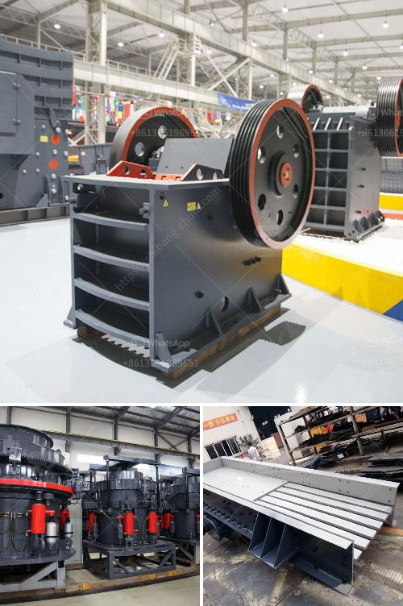

<h3>crushing machine price</h3>
A crushing machine is an essential tool for various industries. It may be used to crush stones, rocks, ore, minerals, or other hard materials. However, deciding on the right crushing machine price can be challenging due to the wide range of options available in the market. This article aims to help you understand the factors that influence crushing machine prices.

1. Machine Type: The price of a crushing machine largely depends on its type. There are different types of crushing machines available, such as jaw crushers, cone crushers, impact crushers, and gyratory crushers. Each type serves a specific purpose and has different features. Consequently, the prices vary. For instance, jaw crushers are generally cheaper compared to cone crushers or gyratory crushers.

2. Capacity: Another crucial factor that affects the price of crushing machines is their capacity. The capacity of a crushing machine refers to the maximum amount of material it can crush per unit of time. Crushing machines with higher capacities are typically more expensive. When determining the required capacity for your specific needs, it is important to consider the volume of material you intend to process regularly.

3. Brand: The brand of a crushing machine is also a significant factor in determining its price. Well-established brands with a proven reputation in the market tend to charge higher prices for their machines. These brands often offer better quality, durability, and after-sales support. While opting for a reputable brand may come at a higher cost, it ensures reliability and longevity, which can save you money in the long run.

4. Specifications: The specifications of a crushing machine, such as motor power, weight, and dimensions, can impact its price. Higher motor power and weight may lead to increased production capacities, but they also increase the price. Additionally, some crushing machines are designed to occupy less space, making them ideal for constrained environments. These compact machines usually have a higher price tag compared to their bulkier counterparts.

5. Additional Features: Some crushing machines come with additional features that enhance their performance and ease of use. These features may include automated settings, advanced control systems, and safety mechanisms, among others. While these extra features add value to a machine, they also come at a price. It is crucial to assess the necessity and benefits of these features against their cost.

6. Market Factors: Crushing machine prices can also be influenced by market factors such as supply and demand, inflation rates, and currency fluctuations. Higher demand for crushing machines or a shortage of raw materials required for production can lead to an increase in prices. Similarly, currency devaluation in the manufacturing country can result in higher costs for imported machines.

In conclusion, purchasing a crushing machine requires careful consideration of various factors. By understanding the machine type, capacity, brand reputation, specifications, additional features, and market fluctuations, you can make a well-informed decision on crushing machine prices. Remember, while it is tempting to opt for the lowest price available, prioritizing quality and long-term performance will ensure a wise investment in your business.
<h3>Contact us</h3><ul><li><strong>Whatsapp:&nbsp;<a href="https://wa.me/8613661969651">+8613661969651</a></strong></li><li><a href="https://swt.shibang-china.com/?git&amp;zhl&amp;crushing machine price"><strong>Online Service(chat now)</strong></a></li></ul><h3>Related</h3><ul><li><a href='harga mesin pemecah batu kapasitas satu ton.md'>harga mesin pemecah batu kapasitas satu ton</a></li><li><a href='hammer mill for cerelaes.md'>hammer mill for cerelaes</a></li><li><a href='industrial vibrator feeder.md'>industrial vibrator feeder</a></li><li><a href='technical specification for ball mill.md'>technical specification for ball mill</a></li><li><a href='hp series cone crusher.md'>hp series cone crusher</a></li></ul>