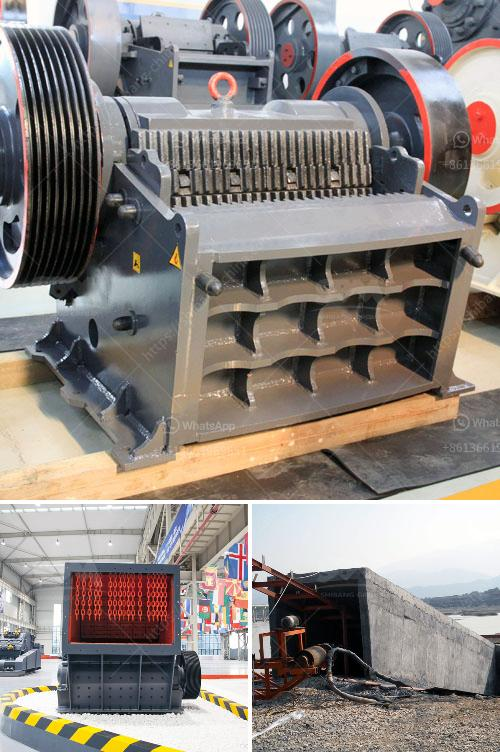

<h3>crushing of concrete in pakistan</h3>
Concrete is the backbone of modern infrastructure, supporting and shaping the developing regions of Pakistan. As the population continues to grow and urbanize, the demand for stronger and more durable concrete structures is escalating. However, despite its utmost importance, one critical aspect of the concrete industry has remained neglected in Pakistan - the crushing of concrete.

Concrete crushing refers to the process of breaking and removing aggregates, such as rocks, gravel, and sand, from concrete structures. The process plays a vital role in recycling and reusing demolished concrete waste, promoting sustainability, and reducing the burden on natural resources.

In Pakistan, the crushing of concrete is often overlooked, leading to wastage of resources, environmental degradation, and increased reliance on imported concrete. This negligence can be attributed to a variety of reasons, such as lack of awareness, limited resources, and the absence of proper infrastructure.

One of the core reasons behind the limited emphasis on concrete crushing in Pakistan is the relatively low awareness levels. Many construction industry professionals, including contractors and engineers, are not fully aware of the benefits and potential of concrete recycling. As a result, they tend to follow traditional practices, such as disposal of demolished concrete waste in landfills, which is detrimental to the environment.

Furthermore, the lack of dedicated equipment, machinery, and expertise for concrete crushing is another pressing challenge. The absence of specialized crushing equipment and facilities makes it difficult to efficiently crush and recycle concrete waste. This leads to additional expenses, as imported concrete becomes the only viable option for fresh construction projects.

In order to address these challenges, it is crucial for the Pakistani construction industry, policymakers, and stakeholders to recognize the importance of concrete crushing and take immediate remedial measures:

1. Awareness Campaigns: Organizations related to the construction industry, non-profit entities, and government bodies should collaborate to raise awareness about the benefits of concrete crushing. This can be done through workshops, seminars, and training sessions to educate professionals about the environmental and economic advantages of recycling concrete waste.

2. Investment in Infrastructure: The government and private sector should invest in the development of concrete crushing facilities and equipment. Setting up dedicated crushing plants and establishing recycling centers can be a significant step towards efficient waste management and resource conservation.

3. Regulatory Framework: The government should enforce regulations and guidelines related to the crushing of concrete waste. Setting standards and creating incentives for the recycling of concrete can encourage construction entities to adopt sustainable practices.

4. Research and Development: The academia, research institutions, and industry professionals should collaborate on research and development initiatives to explore innovative methods of concrete crushing. This can lead to the development of efficient techniques, machinery, and processes to improve the recycling rate and quality of crushed concrete.

The crushing of concrete in Pakistan should be regarded as an urgent need, considering the economic, environmental, and societal benefits. By actively promoting concrete recycling and investing in the necessary infrastructure and awareness campaigns, Pakistan can reduce its dependence on imported concrete, conserve natural resources, and contribute to a greener and more sustainable future.
<h3>Contact us</h3><ul><li><strong>Whatsapp:&nbsp;<a href="https://wa.me/8613661969651">+8613661969651</a></strong></li><li><a href="https://swt.shibang-china.com/?git&amp;zhl&amp;crushing of concrete in pakistan"><strong>Online Service(chat now)</strong></a></li></ul><h3>Related</h3><ul><li><a href='basalt mining crusher.md'>basalt mining crusher</a></li><li><a href='companies manufacturing quarry plant in uk.md'>companies manufacturing quarry plant in uk</a></li><li><a href='primary stone crusher.md'>primary stone crusher</a></li><li><a href='price of copper smelting plant.md'>price of copper smelting plant</a></li><li><a href='business plan for stone grinding in ethiopia.md'>business plan for stone grinding in ethiopia</a></li></ul>