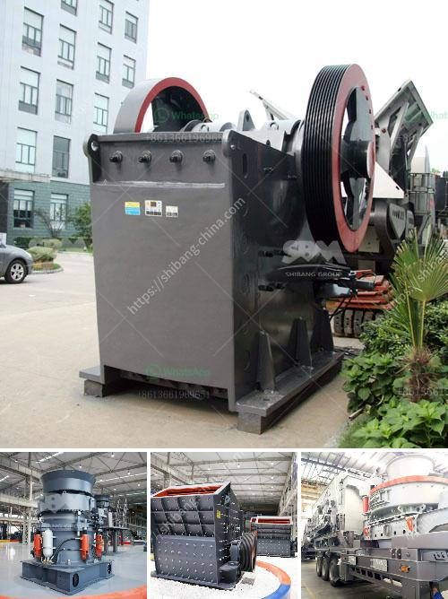

<h3>crushing plant aggregates in south africa</h3>
Crushing plant aggregates in South Africa is a key component of the mining and construction industry. In the crushing plant, aggregates are primarily used as a road base and in concrete and asphalt mixes. Crushed stone, sand, and gravel are the common types of aggregates used, and the nature of the aggregates determines the type of equipment to be used for the crushing process.

In the past, quarries produced a range of aggregates for construction and industrial uses, which included sand and gravel, crushed rock, and limestone. However, over time, the demand for specific types of aggregates has increased, leading to the development of specialized crushing plants.

One of the most significant advantages of operating a crushing plant in South Africa is the abundant availability of natural resources, such as minerals, stone, and rocks. This makes it easier to obtain aggregates of high quality and at competitive prices. The country's rich diversity of mineral resources enables the production of various types of aggregates suitable for different applications.

For instance, South Africa has vast reserves of limestone, which is crushed and used as a road base, fill material, and component in cement manufacturing. Limestone aggregates are also used in landscaping projects and for decorative purposes. Additionally, South Africa has significant deposits of quartzite, granite, and sandstone, which are crushed and used in different construction projects.

In recent years, there has been a growing trend in South Africa towards the use of recycled concrete aggregates (RCA) in the construction industry. RCA is produced by crushing and screening waste concrete from demolition sites and can be used as a substitute for natural aggregates. This not only reduces the demand for natural resources but also helps in the sustainable management of construction and demolition waste.

The process of crushing plant aggregates involves the use of heavy-duty equipment and machinery, such as jaw crushers, cone crushers, and vertical shaft impact crushers, among others. Crushing plant aggregates are mainly composed of rocks, minerals, and sedimentary materials, ensuring efficient processing and reducing waste.

In South Africa, the demand for aggregates from the construction industry has been growing rapidly, creating employment opportunities and stimulating economic growth. Crushing plants are therefore crucial for the success of construction projects in the country.

To ensure the efficient operation of a crushing plant in South Africa, skilled professionals are required to operate and maintain the machinery. They should have sound knowledge of the crushing process and equipment, as well as safety protocols.

In conclusion, crushing plant aggregates in South Africa plays an essential role in the construction industry. The availability of natural resources, optimal equipment selection, and skilled professionals contribute to the success and growth of this industry. With the increasing demand for specific aggregates and the focus on sustainable practices, the future of crushing plant aggregates in South Africa looks promising and dynamic.
<h3>Contact us</h3><ul><li><strong>Whatsapp:&nbsp;<a href="https://wa.me/8613661969651">+8613661969651</a></strong></li><li><a href="https://swt.shibang-china.com/?git&amp;zhl&amp;crushing plant aggregates in south africa"><strong>Online Service(chat now)</strong></a></li></ul><h3>Related</h3><ul><li><a href='crushed stones aggregate in uganda.md'>crushed stones aggregate in uganda</a></li><li><a href='price of crushers and crushers.md'>price of crushers and crushers</a></li><li><a href='calcium ball mill.md'>calcium ball mill</a></li><li><a href='vertical ball mill technology.md'>vertical ball mill technology</a></li><li><a href='rental crusher vertical.md'>rental crusher vertical</a></li></ul>