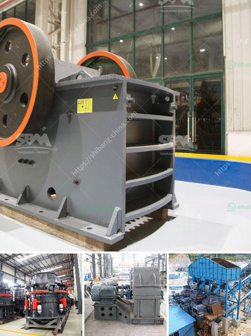

<h3>crushing plant zenith</h3>
In the ever-growing global construction industry, the demand for quality aggregate materials is on the rise. As contractors seek to complete projects efficiently and within budget, having access to a reliable and high-performing crushing plant is essential. When it comes to state-of-the-art crushing equipment, one brand that stands out is Zenith.

Zenith is a renowned manufacturer and supplier of crushing plants, with an extensive track record spanning over several decades. The company has consistently demonstrated its commitment to innovative design, reliable performance, and customer satisfaction. This dedication has earned Zenith a reputation as a global leader in the crushing industry.

One of the standout crushing plants in the Zenith product range is the portable cone crushing plant. This mobile plant is designed for various secondary and tertiary crushing applications, offering high efficiency and low cost per ton processed. Equipped with the proven HP300 cone crusher, it delivers optimal performance, maximizing production while minimizing downtime. The plant also features a large feed opening and high reduction ratio, ensuring excellent end-product quality.

Versatility is a key feature of the Zenith crushing plant. It can be easily transported between job sites, allowing contractors to crush materials at the point of extraction or move it closer to project areas. The modular design of the plant ensures quick and straightforward setup and dismantling, reducing downtime and increasing efficiency.

When it comes to safety, Zenith has not compromised. The portable cone crushing plant is equipped with advanced safety features, including an emergency stop button and guards on all moving parts. This ensures that operators can work with peace of mind, knowing that their safety is prioritized.

Another notable feature of the Zenith crushing plant is its intelligent controls. The plant is equipped with the IC70C control system, which continuously monitors and adjusts the crusher settings to optimize performance. This automation technology not only increases production efficiency but also helps to reduce operating costs by minimizing the risk of human error.

In addition to the portable cone crushing plant, Zenith offers a comprehensive range of crushing plants tailored to meet specific customer needs. From jaw crushers to impact crushers, Zenith has a solution for every crushing application. These plants are built to withstand the harshest working conditions, ensuring long-term reliability and minimal maintenance requirements.

To sum it up, the Zenith crushing plant is a game-changer in the construction industry. With its powerful crushers, easy mobility, safety features, and intelligent controls, it offers contractors a reliable and efficient solution for their crushing needs. Whether it is for large-scale projects or smaller applications, the Zenith crushing plant is designed to take efficiency to new heights.

In a world where time is money, having a crushing plant that is both reliable and productive is crucial. Zenith understands this, and their commitment to providing high-quality crushing equipment is evident in every plant they manufacture. With Zenith by your side, you can crush your way to success.
<h3>Contact us</h3><ul><li><strong>Whatsapp:&nbsp;<a href="https://wa.me/8613661969651">+8613661969651</a></strong></li><li><a href="https://swt.shibang-china.com/?git&amp;zhl&amp;crushing plant zenith"><strong>Online Service(chat now)</strong></a></li></ul><h3>Related</h3><ul><li><a href='mobile and modular coal washing plants.md'>mobile and modular coal washing plants</a></li><li><a href='complete crusher for sale in ghana.md'>complete crusher for sale in ghana</a></li><li><a href='gemstone mining and processing machine.md'>gemstone mining and processing machine</a></li><li><a href='cost analysis of stone quarry in india.md'>cost analysis of stone quarry in india</a></li><li><a href='used portable crushing plant philippines.md'>used portable crushing plant philippines</a></li></ul>