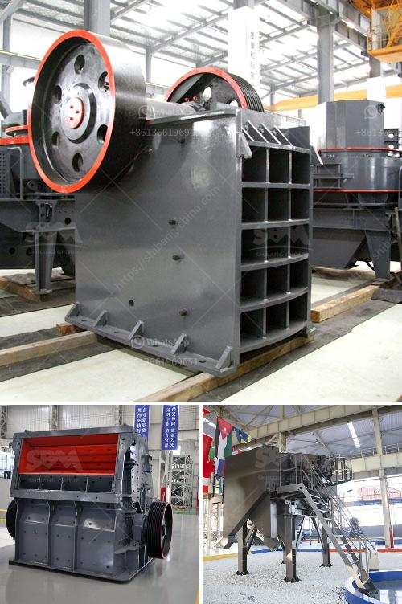

<h3>crushing plants business machinery and construction</h3>
Crushing plants are machines that are utilized to break down large rocks, minerals, and other substances into smaller rocks, gravel, or stone powder. They are commonly used in the construction industry and are able to destroy large rocks and materials, offering a convenient and highly efficient solution for the development of infrastructures, roads, and buildings.

The demand for crushing plants is constantly increasing in the construction industry, as it is acknowledged as an essential part of the construction process. With the rapid development and urbanization around the world, the need for new infrastructure projects is rising. This includes the construction of buildings, roads, bridges, and other structures that require crushed materials.

One of the key advantages of operating in the crushing plant business machinery and construction is that the industry supports the development of various sectors such as real estate, transportation, and infrastructure. The construction industry, in particular, benefits greatly from the use of crushing plants, as it allows for the efficient recycling of waste materials, along with the production of high-quality aggregates, which are essential components in the construction process.

Moreover, the use of crushing plants reduces the need for traditional quarrying, minimizing its impact on the environment. Crushing plants help in the sustainable use of natural resources and reduce the carbon footprint associated with the transportation of materials from quarries.

The crushing plant business machinery and construction industry is becoming increasingly competitive due to the public’s growing expectations for product quality and consistent supply. To meet these demands, machinery needs to perform at a high level, consistently offering reliable, efficient, and safe operations.

Many manufacturers offer a wide range of machinery suitable for crushing plants, including jaw crushers, cone crushers, impact crushers, and grinding mills. These machines are designed to break down materials into smaller pieces, making it easier to transport and more convenient for use in construction.

For entrepreneurs looking into the crushing plant business machinery and construction industry, it is crucial to select machinery that meets specific requirements. Factors such as the type of raw materials being processed, the desired output size, production capacity, and energy consumption should all be considered when choosing the appropriate machinery.

Additionally, proper maintenance and regular servicing of machinery are vital to ensure its longevity and efficient operation. This includes routine inspections, cleaning, and replacing worn parts to avoid any unexpected breakdowns or downtime that could impact productivity.

In conclusion, the crushing plant business machinery and construction industry offer a lucrative opportunity for ambitious entrepreneurs. As the demand for crushed materials continues to rise, the need for efficient and reliable crushing plants will only increase. By offering quality machinery and services, entrepreneurs can tap into this growing market where the demand for construction materials remains high. However, it is essential to carefully select machinery that fits the specific needs of the business and to prioritize proper maintenance to ensure optimal performance.
<h3>Contact us</h3><ul><li><strong>Whatsapp:&nbsp;<a href="https://wa.me/8613661969651">+8613661969651</a></strong></li><li><a href="https://swt.shibang-china.com/?git&amp;zhl&amp;crushing plants business machinery and construction"><strong>Online Service(chat now)</strong></a></li></ul><h3>Related</h3><ul><li><a href='quarry crusher plant in malaysia.md'>quarry crusher plant in malaysia</a></li><li><a href='dolomite crusher price.md'>dolomite crusher price</a></li><li><a href='copper ore ball mill.md'>copper ore ball mill</a></li><li><a href='quartz manufacturing process.md'>quartz manufacturing process</a></li><li><a href='cost of limestone grinding machine.md'>cost of limestone grinding machine</a></li></ul>