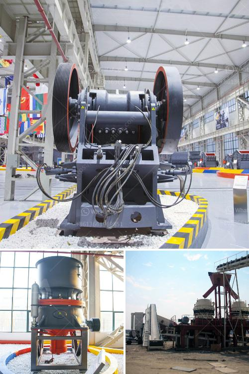

<h3>crushing plants for sale in south africa</h3>
Crushing plants are a crucial component in the mining and aggregate industries. They are utilized to break down larger rocks into smaller, more manageable pieces, allowing for easier transportation and further processing. South Africa, with its vast mineral resources, has for many years been a leading player in the production of these crushing plants.

Crushing plants for sale in South Africa cater to a wide range of applications, such as the production of sand and aggregates, the crushing of rocks and ores, and the beneficiation of minerals. These plants are equipped with various crushing devices including jaw crushers, cone crushers, and impact crushers, providing high performance and flexibility. 

One of the key advantages of purchasing crushing plants for sale in South Africa is their ability to increase productivity and efficiency in mining operations. With their robust construction and advanced technology, these plants are designed to handle the toughest materials, ensuring a consistent output while reducing downtime and maintenance costs.

Another significant advantage of buying crushing plants in South Africa is the cost-effectiveness they offer. The local manufacturing industry produces high-quality plants at competitive prices, making them an attractive option for domestic and international buyers. Additionally, the availability of a wide range of models and configurations ensures that there is a suitable crushing plant for every customer's specific requirements.

South Africa's crushing plants for sale are also environmentally friendly, incorporating features such as dust suppression systems and noise reduction measures. This ensures compliance with strict regulations and promotes sustainable mining practices.

In conclusion, crushing plants for sale in South Africa are an essential investment for mining and aggregate companies. Their robust construction, advanced technology, cost-effectiveness, and environmental friendliness make them an ideal choice for boosting productivity and efficiency while minimizing operational costs. With a wide range of options available, there is a suitable crushing plant to meet the unique needs of every buyer in South Africa.
<h3>Contact us</h3><ul><li><strong>Whatsapp:&nbsp;<a href="https://wa.me/8613661969651">+8613661969651</a></strong></li><li><a href="https://swt.shibang-china.com/?git&amp;zhl&amp;crushing plants for sale in south africa"><strong>Online Service(chat now)</strong></a></li></ul><h3>Related</h3><ul><li><a href='ball mill for ceramic factory.md'>ball mill for ceramic factory</a></li><li><a href='cement process making in philippines.md'>cement process making in philippines</a></li><li><a href='iron ore loading grinding process plant.md'>iron ore loading grinding process plant</a></li><li><a href='sand core making machine.md'>sand core making machine</a></li><li><a href='two prefabricated concrete production line.md'>two prefabricated concrete production line</a></li></ul>