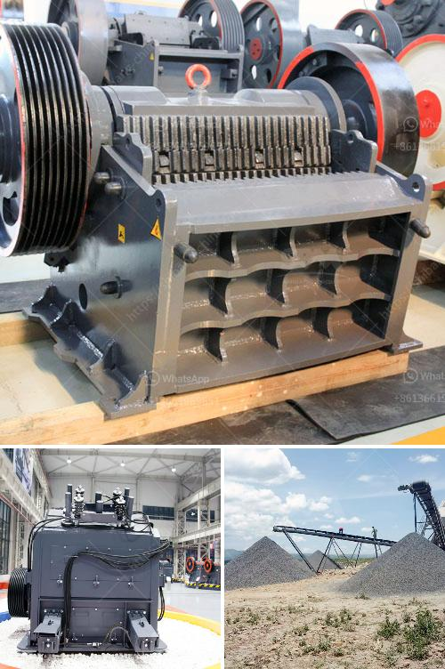

<h3>crushing stone made in germany</h3>
Germany, renowned for its engineering quality, has long been a hotspot for technology innovation. From machinery to industrial plants, German manufacturers have consistently excelled in producing top-quality products. One area where this expertise is particularly evident is in the field of crushing stone.

In the construction industry, stone crushers hold a backbone role. They are the first step in the material handling process. Crushing stones are used to reduce large rocks into smaller particles, such as gravel and dust. These particles are then used as raw materials for various construction projects.

Germany, with its strong industrial background, has been at the forefront of stone crushing technology. Germany's latest high-tech of crushing stone produced by a compact, yet powerful, machine offers an optimal solution for breaking aggregate into smaller-sized materials.

Driven by Germany's advanced technology, the crusher is capable of providing smooth operation with low noise, low power consumption, and good adjusting performance. These crushing machines have been specially designed for crushing hard materials such as limestone. They are equipped with rugged replaceable components, which significantly extend the lifespan and reduce the maintenance cost.

But what sets German crushing machines apart from their counterparts is their flexibility. German crushers are designed to be used in a wide range of applications, from quarrying and mining to recycling construction waste. This versatility is achieved through the use of interchangeable crushing chambers, ensuring the machine can adapt to various tasks.

Furthermore, German-made crushers are renowned for their efficiency and effectiveness. With various crushing techniques, they can produce a uniform cube-shaped final product, which is desirable in the construction industry. This high-quality output is achieved through the use of high-performance hydraulic systems, which adjust the crushing gap precisely and easily.

Apart from their impeccable performance, German crushers are also known for their environmentally friendly features. These machines are equipped with advanced dust suppression systems that minimize the emission of harmful particles during the crushing process. This ensures compliance with environmental regulations while prioritizing the health and safety of workers.

German stone crushers also incorporate modern automation features, reducing human involvement and increasing efficiency. These advanced technologies enable the operator to monitor and control the crushing process from a centralized control room. The automation system ensures precise and consistent product quality, while also maximizing production rates.

In conclusion, Germany has excelled in engineering top-quality crushing machines that are used in the construction industry worldwide. The German-made stone crushing machines offer innovative solutions for crushing and screening applications in sectors such as quarrying, mining, and recycling. Combining high levels of efficiency and flexibility, these machines not only enhance productivity and product quality but also minimize environmental impact. German engineering in the field of stone crushing continues to set the standard for excellence, providing reliable and sustainable solutions for the construction industry.
<h3>Contact us</h3><ul><li><strong>Whatsapp:&nbsp;<a href="https://wa.me/8613661969651">+8613661969651</a></strong></li><li><a href="https://swt.shibang-china.com/?git&amp;zhl&amp;crushing stone made in germany"><strong>Online Service(chat now)</strong></a></li></ul><h3>Related</h3><ul><li><a href='lime powder making.md'>lime powder making</a></li><li><a href='coal crusher buyer in philippines.md'>coal crusher buyer in philippines</a></li><li><a href='tph granite crushing plant for sale.md'>tph granite crushing plant for sale</a></li><li><a href='m sand project cost details.md'>m sand project cost details</a></li><li><a href='mobile dolomite impact crusher for hire.md'>mobile dolomite impact crusher for hire</a></li></ul>