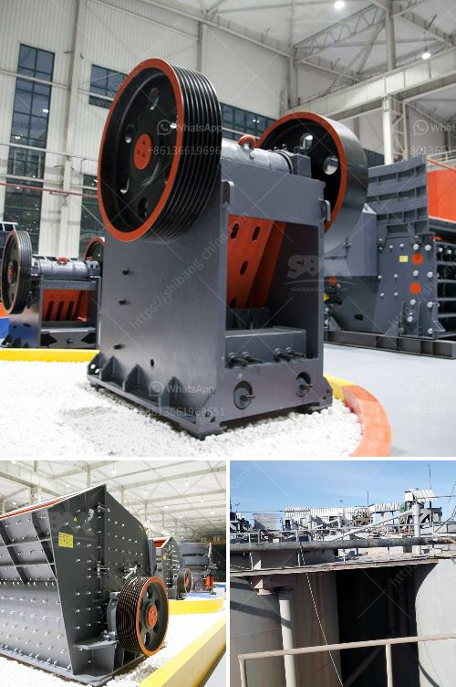

<h3>cutting milling machine for marble and granite</h3>
The stone fabrication industry has witnessed remarkable technological advancements in recent years, and one such revolutionary tool is the cutting milling machine for marble and granite. This state-of-the-art equipment has transformed the way stone fabricators approach the cutting and milling processes, offering unprecedented precision and efficiency beyond traditional methods.

The cutting milling machine is designed to precisely cut and shape marble and granite slabs with incredible accuracy. It utilizes advanced computer numerical control (CNC) technology to automate the cutting and milling operations, ensuring consistent results and minimizing human error. 

One of the key advantages of this machine is its ability to produce intricate designs and patterns on stone surfaces. With its high-speed rotating spindle and specialized cutting tools, it can effortlessly create detailed engravings, curves, and unique shapes that were once incredibly difficult and time-consuming to achieve by hand. This opens up a world of possibilities for stone fabricators, allowing them to create breathtaking works of art and satisfy even the most discerning customer demands.

Moreover, the cutting milling machine offers exceptional efficiency and productivity. It can process multiple slabs simultaneously, drastically reducing production time and increasing output. This not only saves valuable time for fabricators but also enables them to meet tight deadlines and take on more projects, ultimately driving business growth.

Furthermore, the machine's advanced software provides precise control over the cutting and milling parameters. Fabricators can easily adjust the depth, speed, and angle of the cuts, allowing them to achieve the desired results with absolute precision. This level of control ensures a superior finish, minimizing the need for manual rework and enhancing the overall quality of the final product.

In terms of safety, the cutting milling machine incorporates various safety features to protect operators and prevent accidents. These include emergency stop buttons, safety interlocks, and protective enclosures, ensuring a safe working environment for fabricators.

Overall, the cutting milling machine for marble and granite has revolutionized the stone fabrication industry. Its advanced technology, precision, efficiency, and safety features have significantly enhanced the cutting and milling processes. As a result, stone fabricators can deliver flawless results, take on more projects, and expand their capabilities, ultimately boosting their competitiveness in the market. This tool is a game-changer for the industry, fueling innovation and creativity in the world of stone fabrication.
<h3>Contact us</h3><ul><li><strong>Whatsapp:&nbsp;<a href="https://wa.me/8613661969651">+8613661969651</a></strong></li><li><a href="https://swt.shibang-china.com/?git&amp;zhl&amp;cutting milling machine for marble and granite"><strong>Online Service(chat now)</strong></a></li></ul><h3>Related</h3><ul><li><a href='self healing process of limestone.md'>self healing process of limestone</a></li><li><a href='hammer mills for sand.md'>hammer mills for sand</a></li><li><a href='vibrating screens manufacturers india.md'>vibrating screens manufacturers india</a></li><li><a href='quarry stone business plan pdf.md'>quarry stone business plan pdf</a></li><li><a href='silica sand washing plant.md'>silica sand washing plant</a></li></ul>