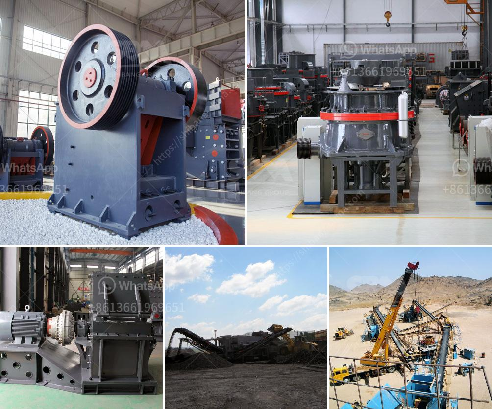

<h3>dealer of vibrating screen philippines</h3>
In the world of industrial machinery, a vibrating screen serves crucial roles. It enables efficient sorting, grading, and separation of various materials, making it a vital equipment across different industries such as mining, construction, and aggregates. If you are in the Philippines and in need of a reliable dealer of vibrating screens, read on to learn how to choose the best one.

Firstly, it is important to consider the reputation and track record of the dealer. Look for companies that have been in the industry for several years, as this indicates their experience and expertise. A dealer with a strong track record will likely have a good reputation among its previous clients, which can be verified by reading online reviews or asking for recommendations from industry professionals.

Next, assess the quality of the vibrating screens offered by the dealer. High-quality screens are essential for optimal performance and longevity. Look for dealers that offer screens made from durable materials, such as stainless steel or high-tensile steel, as these are known for their resistance to wear and tear. Additionally, inquire about the manufacturing process and quality control measures implemented by the dealer to ensure that the screens meet industry standards.

Another crucial factor to consider is the range of vibrating screens offered by the dealer. Different industries require different types of screens, so it is important to choose a dealer that offers a wide variety of options. Common types of vibrating screens include linear vibrating screens, circular vibrating screens, and high-frequency vibrating screens. Additionally, inquire about the available screen sizes, as well as any customization options offered by the dealer.

The after-sales support provided by the dealer is also an important consideration. Vibrating screens are complex machines that may require maintenance, repair, or replacement parts from time to time. Therefore, choose a dealer that offers reliable after-sales support, including technical assistance, spare parts availability, and warranty coverage. A dealer that is committed to providing excellent after-sales service will ensure that your vibrating screens remain in optimal condition and minimize downtime.

Lastly, consider the price and overall value offered by the dealer. While it may be tempting to choose the dealer with the lowest price, it is important to also consider the quality and features of the vibrating screens. Look for dealers that offer competitive prices without compromising on the quality and reliability of their products. Additionally, inquire about any additional services or perks offered by the dealer, such as installation assistance or training for operators.

In conclusion, finding a reliable dealer of vibrating screens in the Philippines is crucial for industries that require efficient material sorting and separation. When choosing a dealer, consider factors such as reputation, quality of the screens, range of options, after-sales support, and overall value. By carefully evaluating these factors, you can make an informed decision and choose the best dealer for your vibrating screen needs.
<h3>Contact us</h3><ul><li><strong>Whatsapp:&nbsp;<a href="https://wa.me/8613661969651">+8613661969651</a></strong></li><li><a href="https://swt.shibang-china.com/?git&amp;zhl&amp;dealer of vibrating screen philippines"><strong>Online Service(chat now)</strong></a></li></ul><h3>Related</h3><ul><li><a href='impact crusher on sale.md'>impact crusher on sale</a></li><li><a href='vibrating screen in egypt.md'>vibrating screen in egypt</a></li><li><a href='stone crushing plants in malaysia.md'>stone crushing plants in malaysia</a></li><li><a href='used ultra fine wet grinding mill gold ore.md'>used ultra fine wet grinding mill gold ore</a></li><li><a href='cement plant ataustralia.md'>cement plant ataustralia</a></li></ul>