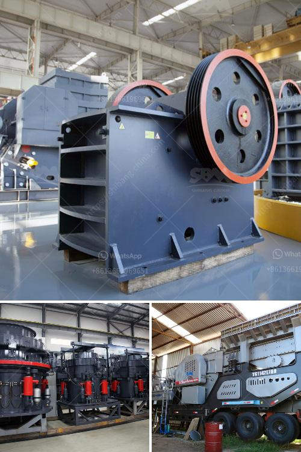

<h3>dealers of hammer mill in nigeria</h3>
Hammer mills are essential equipment for many farms and businesses in Nigeria, especially when it comes to grinding grains and other agricultural products for commercial and household consumption. With the huge demand for these mills, finding the right dealers of hammer mills in Nigeria can be a daunting task.

One of the essential things to consider when looking for a dealer of hammer mills in Nigeria is the reputation of the dealer. You want to work with a dealer who is known for providing quality products and has a good track record of customer satisfaction. You can check online reviews and testimonials from previous customers to gauge the dealer's reputation. Additionally, you can ask for referrals from people in the same industry to recommend reliable dealers they have worked with before.

Another important factor to consider is the range of hammer mills offered by the dealer. Nigeria is a diverse country with various agricultural products. Therefore, it is crucial to find a dealer that offers a wide selection of hammer mills to suit the specific needs of different farmers and businesses. Whether you need a small-scale hammer mill for domestic use or a larger one for commercial purposes, the dealer should have options available that fit your requirements.

Price is also a key consideration when choosing a dealer of hammer mills in Nigeria. While you want to get the best quality hammer mill, you also need to find one that fits within your budget. It is advisable to compare prices from different dealers to ensure you get the best value for your money. However, be wary of extremely low prices, as they may indicate poor quality products.

Additionally, it is important to consider the dealer's after-sales service. A reputable dealer should provide excellent customer support and readily assist with any issues that may arise after the purchase. This can include technical support, spare parts availability, and warranty coverage. Buying a hammer mill is a long-term investment, and having a reliable dealer who can provide assistance when needed is crucial for its efficient operation.

Some of the top dealers of hammer mills in Nigeria include ABC Machinery, Saro Agro Industrial, and Nigerian Foundries Ltd. These dealers offer a wide range of hammer mills that are suitable for different applications. They are known for their quality products, excellent customer service, and competitive prices. Additionally, they have a strong presence both online and offline, making it convenient for customers to reach out to them.

In conclusion, finding the right dealer of hammer mills in Nigeria requires thorough research and careful consideration. It is essential to choose a reputable dealer with a good track record, a wide selection of hammer mills, competitive prices, and excellent after-sales service. By following these guidelines, you can ensure that you make an informed decision and find a dealer that meets your needs.
<h3>Contact us</h3><ul><li><strong>Whatsapp:&nbsp;<a href="https://wa.me/8613661969651">+8613661969651</a></strong></li><li><a href="https://swt.shibang-china.com/?git&amp;zhl&amp;dealers of hammer mill in nigeria"><strong>Online Service(chat now)</strong></a></li></ul><h3>Related</h3><ul><li><a href='jaw crusher for rent indonesia.md'>jaw crusher for rent indonesia</a></li><li><a href='how to make a business plan for crusher plant.md'>how to make a business plan for crusher plant</a></li><li><a href='clay production plant.md'>clay production plant</a></li><li><a href='used crusher rock mining germany.md'>used crusher rock mining germany</a></li><li><a href='fine grinding ball mills.md'>fine grinding ball mills</a></li></ul>