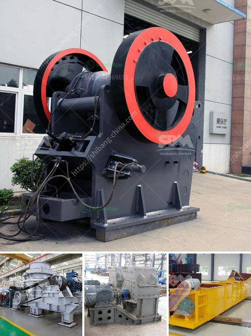

<h3>decibels generated by hebro jaw crusher</h3>
The Herbst Agri Crusher is a heavy duty, tractor-based jaw crusher machine designed to crush and grind rock and stone materials. Its unique design enables it to be easily mounted onto any tractor and can be used for various construction and excavation purposes.

One important factor to consider when operating the Herbst Agri Crusher is the noise levels generated. Given the nature of the machine and its powerful motor, it is expected that the crusher would produce high levels of noise. Decibels (dB) are used to measure sound intensity, with higher values indicating louder noise levels. In this article, we will discuss the decibels generated by the Herbst Agri Crusher during its operation.

It is important to note that the noise levels generated by the Herbst Agri Crusher can vary depending on several factors, including the type of material being crushed, the speed of operation, and the condition of the machine itself. The manufacturer provides a guideline stating that the noise levels produced by the crusher are within the range of 85-90 dB during normal operation. However, it is advisable to conduct specific noise assessments at the specific site of operation to confirm the actual noise levels.

To put these noise levels into perspective, it is important to understand what various dB values mean in terms of everyday examples. For instance, 85 dB is equivalent to the noise level of heavy city traffic, while 90 dB is comparable to the sound of a lawnmower. Although these levels may seem high, it is crucial to bear in mind that construction and excavation activities often involve various machinery producing similar or even higher noise levels.

To ensure compliance with noise regulations and to protect the hearing health of workers, it is recommended to implement noise control measures when operating the Herbst Agri Crusher. The installation of noise barriers or enclosures around the machine can help reduce the spread of noise to neighboring areas. In addition, regular maintenance and inspection of the crusher can help identify any potential issues that may contribute to increased noise levels. These measures are not only important for meeting regulatory requirements but also for promoting a safer and healthier work environment.

When considering the use of the Herbst Agri Crusher, it is essential to assess the specific site conditions and to consider any local noise regulations. This will help determine whether additional noise control measures need to be implemented. It is important to note that noise control is not only a legal obligation but also a responsible approach to ensure the well-being of workers and the surrounding community.

In conclusion, the Herbst Agri Crusher is a powerful machine designed to crush and grind various materials. It does generate considerable noise levels during operation, which can range between 85-90 dB. However, implementing noise control measures and conducting regular maintenance can help mitigate these noise levels and ensure compliance with regulations. By addressing the issue of noise, we can create a safer and more sustainable work environment for everyone involved in the operation of the Herbst Agri Crusher.
<h3>Contact us</h3><ul><li><strong>Whatsapp:&nbsp;<a href="https://wa.me/8613661969651">+8613661969651</a></strong></li><li><a href="https://swt.shibang-china.com/?git&amp;zhl&amp;decibels generated by hebro jaw crusher"><strong>Online Service(chat now)</strong></a></li></ul><h3>Related</h3><ul><li><a href='mobile concrete crusher.md'>mobile concrete crusher</a></li><li><a href='how much cost silicon quartz stone.md'>how much cost silicon quartz stone</a></li><li><a href='list of quarry operators in uae.md'>list of quarry operators in uae</a></li><li><a href='mining processing machine supplier companies in pakistan.md'>mining processing machine supplier companies in pakistan</a></li><li><a href='between cone and horizontal impact crusher.md'>between cone and horizontal impact crusher</a></li></ul>