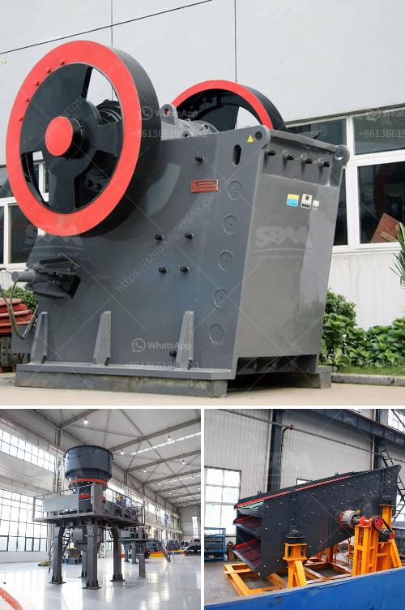

<h3>defination of machine aggregate crusher</h3>
A machine aggregate crusher, also known as a jaw crusher, is classified as one of the primary tools used in the mining industry. It is common for this equipment to operate 24/7. The machine consists of a fixed jaw, one swing jaw, two side cheek plates, a feed hopper, and a conveyor belt. The jaw crushers are capable of crushing different types of materials, such as rocks, glass, limestone, granite, and even construction waste.

The primary function of the machine aggregate crusher is to reduce the size of large rocks into smaller ones, specifically in the construction and mining industries. The process begins with the rocks being fed into the feed hopper, which then delivers the material to the crushing chamber. The fixed jaw and moveable jaw work together to apply compression force, gradually breaking down the material into smaller pieces.

The central component of the machine aggregate crusher is the jaw plates. These plates create a V-shaped cavity called the crushing chamber, where the rocks are crushed as the moveable jaw moves towards the fixed jaw. The force exerted by the jaws can be adjusted by tightening or loosening the tension rod, controlling the size of the final product.

To enhance productivity and efficiency, some jaw crushers feature an overhead eccentric rotation mechanism. This design enables the swing jaw to have a more aggressive motion, providing better crushing capacity and reducing wear on the jaw plates.

Another important aspect of machine aggregate crushers is the presence of side cheek plates. These plates protect the sides of the crushing chamber from wear and tear caused by rocks hitting the walls. They also play a role in controlling the width of the final product by adjusting the distance between the jaws.

The crushed material exits the crushing chamber through the bottom opening called the discharge opening. To ensure a continuous flow of crushed material, a conveyor belt is often used to transport the material from the jaw crusher to a stockpile or the next stage of processing.

Machine aggregate crushers are available in various sizes and capacities to accommodate different production requirements. Smaller units are often used for laboratory testing and small-scale operations, while larger crushers are utilized in mining and industrial applications.

In conclusion, a machine aggregate crusher is a powerful tool used in the mining and construction industries to break down large rocks into smaller, more manageable sizes. It enables the extraction of valuable minerals and the production of construction materials. With a variety of sizes and configurations available, these crushers are versatile and essential in many operations.
<h3>Contact us</h3><ul><li><strong>Whatsapp:&nbsp;<a href="https://wa.me/8613661969651">+8613661969651</a></strong></li><li><a href="https://swt.shibang-china.com/?git&amp;zhl&amp;defination of machine aggregate crusher"><strong>Online Service(chat now)</strong></a></li></ul><h3>Related</h3><ul><li><a href='hammer mill design plans pdf mtm crusher.md'>hammer mill design plans pdf mtm crusher</a></li><li><a href='barite mill cost.md'>barite mill cost</a></li><li><a href='silica water washing plant manufacturers in india.md'>silica water washing plant manufacturers in india</a></li><li><a href='limestone crusher machine limus.md'>limestone crusher machine limus</a></li><li><a href='robo sand making equipment rates in india.md'>robo sand making equipment rates in india</a></li></ul>