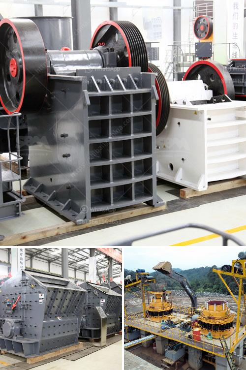

<h3>design of stone crushing machine</h3>
Stone crushing machine is the necessary equipment in the mining machinery industry. The common stone crushing machines are jaw crusher, cone crusher, hammer crusher, roller crusher and so on. Different crushers have different crushing principles and particle sizes, and they are targeted towards different materials. Therefore, when choosing a crusher, users should determine their actual needs and choose the right crusher according to the nature of the material to be crushed, the required product size, and the production capacity.

The design of stone crushing machines is critical for the efficient operation of these machines. Since the principal goal of a stone crushing machine is to facilitate the process of crushing different types of stones, it is crucial to understand the characteristics of the stone crushers that make this possible. In this regard, the design of the crushing machine is the key.

The main objective of the design of a stone crushing machine is to have a machine that can be used to crush major types of stones in a simple, economical, efficient and environmentally friendly manner. Some of the most essential design aspects of the machine include the determination of the rotation speed of the shaft, the choice of the appropriate bearing, the selection of the optimal size of the crushing chamber, and the arrangement of the crushing elements (such as the hammers or blades).

The rotation speed of the shaft is crucial in determining the crushing capacity of the machine. A higher rotation speed facilitates the crushing process by ensuring that the stones are crushed effectively. However, an excessively high rotation speed can lead to issues such as frequent breakdowns and increased power consumption. Therefore, the rotation speed needs to be optimized to strike the right balance between crushing efficiency and machine durability.

The choice of the bearing is also critical in determining the performance of the machine. The bearing should be able to withstand the heavy loads and vibrations generated during the crushing process. It should also have the ability to dissipate the heat generated by the crushing operation. Overall, the bearing should be extremely durable to ensure continuous and reliable operation of the machine.

The size of the crushing chamber and the arrangement of the crushing elements are important factors that determine the particle size distribution of the crushed material. The crushing chamber should have a size that allows the stones to be effectively crushed and discharged. The arrangement of the crushing elements should be designed in a way that ensures proper and efficient crushing of the stones.

In conclusion, the design of a stone crushing machine plays a crucial role in the efficient operation of the machine. The process of designing the machine involves determining the crushing capacity, shaft rotation speed, and bearing size and selection, among others. These factors determine the performance and efficiency of the machine in crushing different types of stones. Therefore, it is important for designers to carefully consider these factors during the design process to ensure that the stone crushing machine meets the required specifications and performs optimally.
<h3>Contact us</h3><ul><li><strong>Whatsapp:&nbsp;<a href="https://wa.me/8613661969651">+8613661969651</a></strong></li><li><a href="https://swt.shibang-china.com/?git&amp;zhl&amp;design of stone crushing machine"><strong>Online Service(chat now)</strong></a></li></ul><h3>Related</h3><ul><li><a href='mini mobile crusher plant for sale.md'>mini mobile crusher plant for sale</a></li><li><a href='price of a stone crusher.md'>price of a stone crusher</a></li><li><a href='used ultra fine wet grinding mill gold ore.md'>used ultra fine wet grinding mill gold ore</a></li><li><a href='price stone crusher dragon.md'>price stone crusher dragon</a></li><li><a href='malaysia mobile cone crusher price.md'>malaysia mobile cone crusher price</a></li></ul>