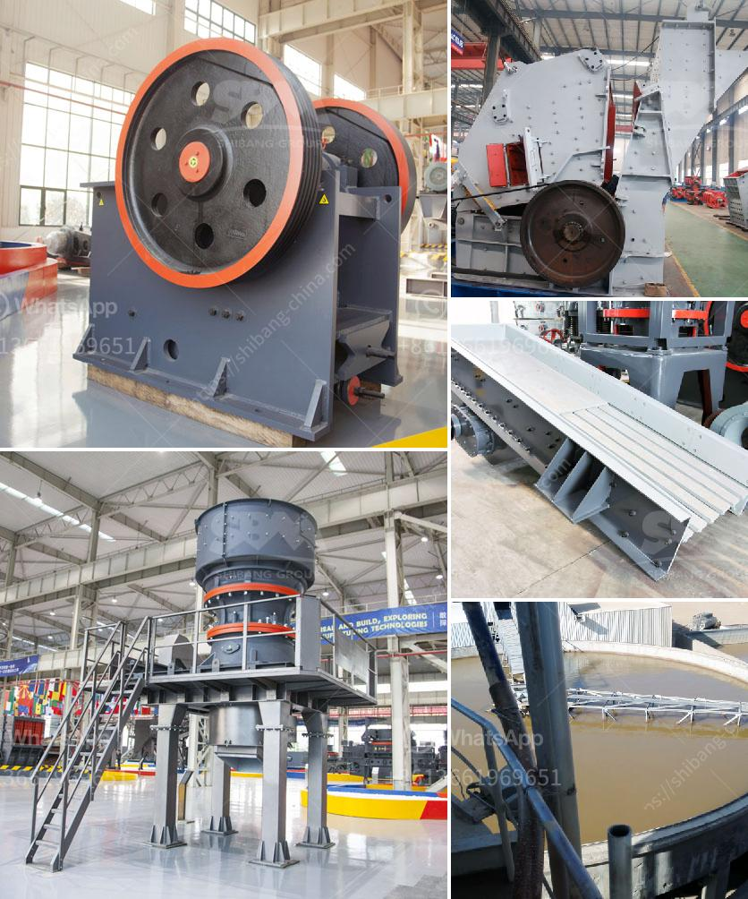

<h3>diamond mining equipment and pictures</h3>
Diamond mining is a complex and highly specialized process that requires the use of state-of-the-art equipment. These tools not only help miners extract diamonds from deep beneath the earth's surface but also ensure the safety of the workers involved.

One of the most crucial pieces of equipment used in diamond mining is the diamond drill. These drills are powerful machines that can penetrate the earth's crust and reach the diamond-bearing kimberlite pipes. Diamond drills extract core samples, allowing miners to analyze the quality and quantity of the diamonds present before committing to large-scale mining operations. These machines are equipped with diamond-encrusted drill bits that can cut through even the toughest rock formations.

Another essential tool utilized in diamond mining is the alluvial mining equipment. Alluvial mining is the process of extracting diamonds from alluvial deposits, which are loose deposits of soil, gravel, and rocks that are formed by natural processes such as erosion. To effectively mine alluvial deposits, miners use various types of equipment, including excavators, bulldozers, and pumps. These machines help remove layers of soil and rock to expose the diamond-rich gravel.

Once the diamonds have been extracted from the ground, they are then sorted and classified using diamond sorting machines. These machines utilize advanced technology, such as X-rays and lasers, to identify and separate diamonds based on their size, quality, and color. This ensures that only the best diamonds are chosen for further processing and eventual sale.

It is worth noting that diamond mining equipment also includes safety gear and monitoring devices to ensure the well-being of the workers. Protective clothing, such as helmets, gloves, and boots, are crucial in safeguarding miners from potential hazards. Additionally, ventilation systems and gas detectors help monitor air quality and prevent the build-up of harmful gases in the underground mining areas.

In conclusion, diamond mining equipment is an indispensable part of the diamond mining process. From drills to sorting machines, this equipment ensures the successful extraction, sorting, and classification of diamonds. Moreover, it guarantees the safety and well-being of those involved in this demanding industry.
<h3>Contact us</h3><ul><li><strong>Whatsapp:&nbsp;<a href="https://wa.me/8613661969651">+8613661969651</a></strong></li><li><a href="https://swt.shibang-china.com/?git&amp;zhl&amp;diamond mining equipment and pictures"><strong>Online Service(chat now)</strong></a></li></ul><h3>Related</h3><ul><li><a href='ultrafine powder mill.md'>ultrafine powder mill</a></li><li><a href='concrete crusher in georgia.md'>concrete crusher in georgia</a></li><li><a href='quarry equipment manufacturers.md'>quarry equipment manufacturers</a></li><li><a href='stone crusher gangs in jamaica.md'>stone crusher gangs in jamaica</a></li><li><a href='grinding unit and plant in india.md'>grinding unit and plant in india</a></li></ul>