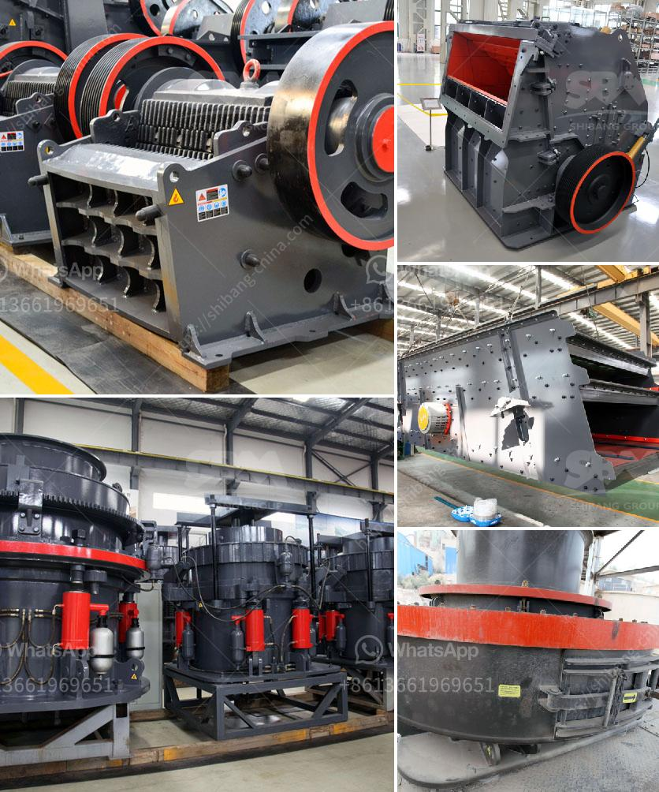

<h3>diesel compressors for sale in south africa</h3>
South Africa is a country known for its diverse industries, ranging from mining to construction, manufacturing, and agriculture. These industries require reliable and efficient machinery to carry out various tasks, and one such essential equipment is the diesel compressor. Diesel compressors offer portability, power, and versatility, making them an ideal choice for a wide range of applications.

A diesel compressor is a machine that uses diesel fuel to power an air compressor. The compressor compresses air which can then be used to power various tools and equipment, such as jackhammers, pneumatic drills, sandblasters, and spray guns. The advantage of using a diesel-powered compressor is that it eliminates the need for electricity, making it suitable for remote locations, where power supply may be limited.

When looking for diesel compressors for sale in South Africa, there are several key factors to consider. Firstly, it is important to determine the required capacity of the compressor in terms of the volume of air it can deliver per minute (CFM or cubic feet per minute). This capacity should match the demands of the specific application for which the compressor will be used.

Another crucial factor to consider is the pressure rating of the compressor, which is measured in pounds per square inch (PSI). Different applications require different pressure levels, so it is important to choose a compressor with the appropriate rating for the intended tasks. In addition, considering the size and weight of the compressor is vital, especially if portability is a priority.

South Africa is known for its harsh working conditions, with hot temperatures, dusty environments, and uneven terrains being common challenges. Therefore, it is essential to select a diesel compressor that is built to withstand such conditions. Look for compressors made from high-quality materials, with reliable engines and sturdy frames that can handle the demands of the job site.

When considering diesel compressors for sale, it is also crucial to look for reputable brands and trusted suppliers. Choose a supplier that offers a wide selection of compressors, allowing you to find the perfect fit for your needs. Additionally, ensure that the supplier provides reliable after-sales service, including maintenance, repairs, and spare parts availability. This is essential for continuous and uninterrupted operation of the compressor.

In conclusion, diesel compressors for sale in South Africa offer a powerful and versatile solution for various industries. With their portability, durability, and ability to operate in remote areas, these machines are a valuable asset for any job site. When searching for a diesel compressor, it is important to consider factors such as capacity, pressure rating, size, and weight, as well as the reliability and reputation of the supplier. By carefully considering these factors, you can find a diesel compressor that meets your specific needs and ensure seamless operations in your industry.
<h3>Contact us</h3><ul><li><strong>Whatsapp:&nbsp;<a href="https://wa.me/8613661969651">+8613661969651</a></strong></li><li><a href="https://swt.shibang-china.com/?git&amp;zhl&amp;diesel compressors for sale in south africa"><strong>Online Service(chat now)</strong></a></li></ul><h3>Related</h3><ul><li><a href='project report of lime processing unit.md'>project report of lime processing unit</a></li><li><a href='crushing machine price.md'>crushing machine price</a></li><li><a href='hand portable rock crusher.md'>hand portable rock crusher</a></li><li><a href='machinery conveyor belts.md'>machinery conveyor belts</a></li><li><a href='small ball mill for sale.md'>small ball mill for sale</a></li></ul>