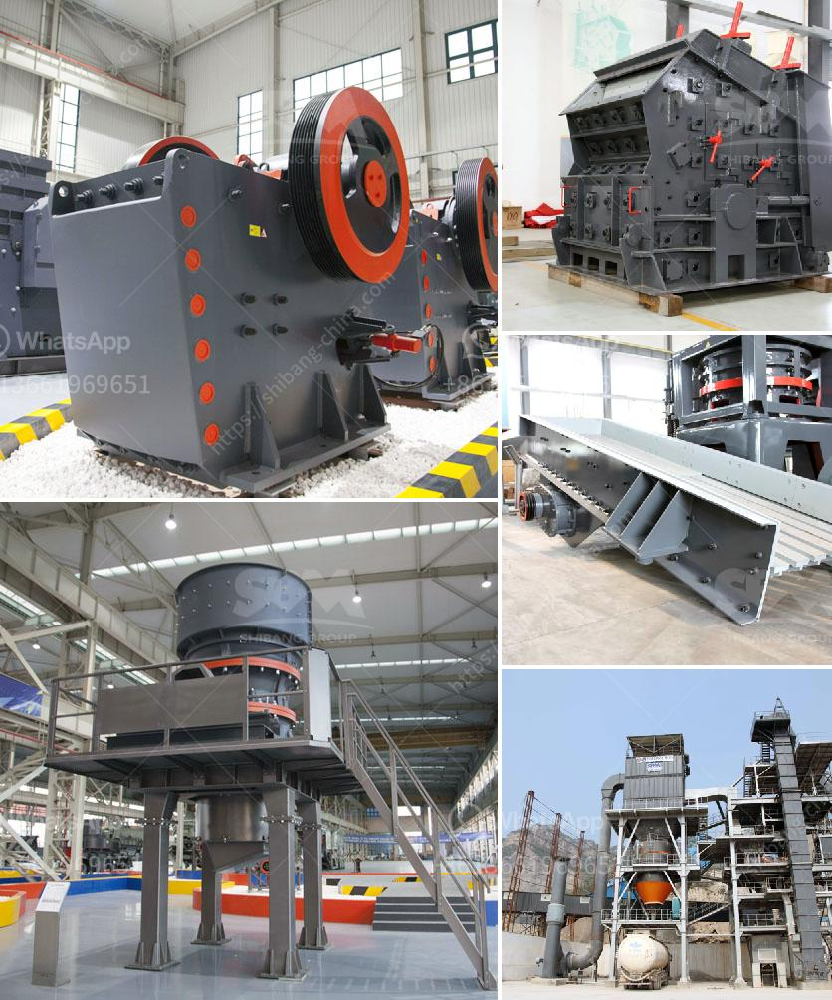

<h3>difference between hp cone crusher</h3>
The HP cone crusher is a versatile and high-performance crushing machine, which has been created to effectively handle the most demanding applications. Its size allows it to be used as a secondary or tertiary crusher in mining operations and as a mobile or stationary solution for medium-hard to hard and abrasive rock and ores.

One of the key differences between the HP cone crusher and other cone crushers is its efficient use of power. The cone crusher relies on its hydraulic system to provide the necessary power to securely and smoothly control the hydraulic tramp release and clearing functions. This ensures that the crusher remains protected, reducing downtime and maintenance costs.

Another significant difference is the HP cone crusher’s ability to produce a consistent product size with fewer crushing stages, reducing the overall energy consumption and operational costs. This is achieved by combining a higher eccentricity, a larger feed opening, and a steeper crushing chamber, which increases the production capacity and delivers a more uniform product shape.

Furthermore, the HP cone crusher offers a unique combination of crusher speed, throw, crushing forces, and cavity design. This enables it to provide higher reduction ratios and more efficient operation. The cone crusher’s robust design and high-quality components maximize the crusher’s lifespan and reliability, ensuring peak performance throughout its service life.

In addition, the HP cone crusher features a large feed opening, which can handle a wide range of feed sizes, enabling it to accommodate various crushing applications. Its advanced automation system ensures easy and safe operation, allowing operators to optimize crusher performance and maximize productivity.

Overall, the HP cone crusher is a reliable and efficient machine, which offers numerous advantages over other cone crushers. With its ability to produce a consistent product size, efficient use of power, and robust design, it stands out as an excellent choice for any crushing application. Whether used in a mining operation or as a stationary or mobile solution, the HP cone crusher delivers exceptional performance and is a valuable asset to any crushing circuit.
<h3>Contact us</h3><ul><li><strong>Whatsapp:&nbsp;<a href="https://wa.me/8613661969651">+8613661969651</a></strong></li><li><a href="https://swt.shibang-china.com/?git&amp;zhl&amp;difference between hp cone crusher"><strong>Online Service(chat now)</strong></a></li></ul><h3>Related</h3><ul><li><a href='copper ore vertical ball mill.md'>copper ore vertical ball mill</a></li><li><a href='list of stone crushers in odisha.md'>list of stone crushers in odisha</a></li><li><a href='coal crushing and washing plant for sale in south africa.md'>coal crushing and washing plant for sale in south africa</a></li><li><a href='komatsu mobile crushers price.md'>komatsu mobile crushers price</a></li><li><a href='crusher machine in uae.md'>crusher machine in uae</a></li></ul>