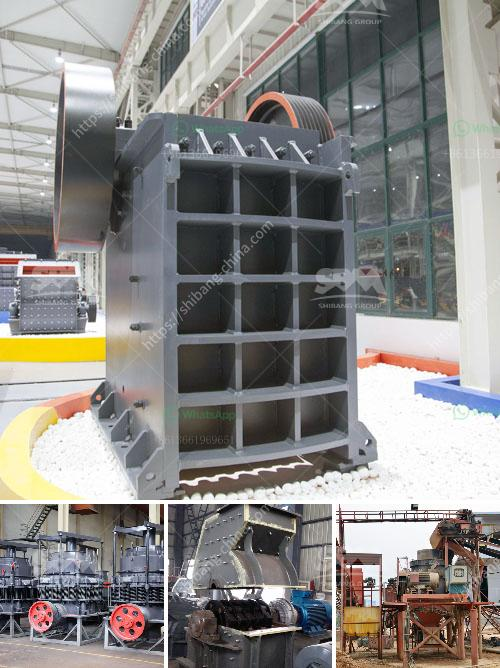

<h3>difference between pebble and stone</h3>
Pebbles and stones are both common natural materials found in various environments worldwide. While they may seem similar at first glance, there are distinct differences between the two that set them apart. Understanding these disparities can enhance our knowledge of geology and open doors to creative landscaping and interior design possibilities.

One of the primary distinctions between pebbles and stones lies in their size. Pebbles are generally smaller than stones, typically measuring between 2 and 64 millimeters in diameter. They are frequently shaped after years of natural weathering, resulting in smooth, round edges. These smooth surfaces make pebbles ideal for walking on beaches or for use in decorative arrangements, as they are pleasant to touch and visually appealing.

In contrast, stones are larger and more irregular in shape. While there is no exact size range that defines a stone, they are generally larger than pebbles and can range from a few centimeters to several meters in size. Stone surfaces are often rougher and more textured due to their natural formation processes, making them a more suitable material for construction purposes, such as building walls or foundations.

Another key distinction between pebbles and stones is their composition. Pebbles are commonly comprised of small rock fragments, typically eroded from larger rock formations or debris transported by water currents. As they are often rounded from being tumbled against other pebbles or rocks in rivers or oceans, pebbles are typically smooth and polished, boasting an appealing aesthetic.

In contrast, stones can be made up of a variety of materials, including minerals, rocks, and even fossils. Some common types of stones include granite, limestone, sandstone, and marble, each with its unique characteristics. As a result, stones can exhibit a wide array of colors, patterns, and textures that can add depth and interest to any space where they are utilized.

The uses for pebbles and stones also tend to differ due to their physical properties. Due to their smaller size and smooth surfaces, pebbles are commonly employed in decorative purposes. Landscaping designs often feature pebbles in paths, flowerbeds, or water features, contributing a natural and tranquil ambiance. Pebbles are also used in crafting, including making jewelry or mosaic artworks, due to their attractive appearance.

Stones, on the other hand, are known for their strength and durability. Their roughness lends well to construction purposes, including building sturdy structures like walls or walkways. Stones can also retain heat, making them suitable for use in fireplaces or flooring choices. In addition, stones have been a popular choice for creating statues, monuments, or sculptures throughout history due to their ability to withstand the elements.

In conclusion, while pebbles and stones are both natural materials found in various environments, their differences lie in size, composition, and uses. Pebbles are smaller, smooth, and primarily used for decoration, while stones tend to be larger, more irregular, and utilized in construction projects. Understanding the distinctions between these two materials can lead to creative applications in interior design, landscaping, and construction, ultimately enhancing our appreciation for nature's remarkable creations.
<h3>Contact us</h3><ul><li><strong>Whatsapp:&nbsp;<a href="https://wa.me/8613661969651">+8613661969651</a></strong></li><li><a href="https://swt.shibang-china.com/?git&amp;zhl&amp;difference between pebble and stone"><strong>Online Service(chat now)</strong></a></li></ul><h3>Related</h3><ul><li><a href='barite mining process.md'>barite mining process</a></li><li><a href='clay crusher machine in india.md'>clay crusher machine in india</a></li><li><a href='how to start a stone crushing business in nigeria.md'>how to start a stone crushing business in nigeria</a></li><li><a href='crushing equipment from.md'>crushing equipment from</a></li><li><a href='silica water washing plant manufacturers in india.md'>silica water washing plant manufacturers in india</a></li></ul>